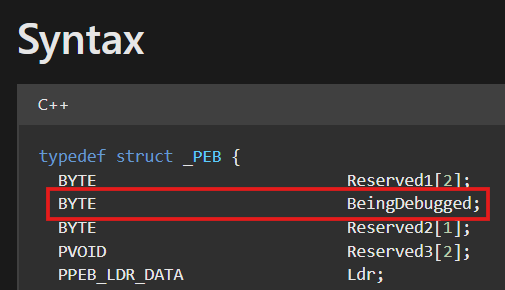

# DEBUG FLAGS
## **[1] IsDebuggerPresent() và PEB!BeingDebugged Flag**
- Trong cấu trúc của PEB, có 1 trường tên là `BeingDebugged`.

- Khi 1 chương trình được tải vào bộ nhớ, giá trị của trường này sẽ được đặt, nếu là giá trị 0 thì chương trình này đang không bị debug và ngược lại.
- Hàm `IsDebuggerPresent()` dựa trên flag `BeingDebugged` để return giá trị 0 (không bị debug) hoặc 1 (đang bị debug).
- Nói cách khác, nếu muốn kiểm tra chương trình có đang bị gắn debugger hay không thì kiểm tra trực tiếp giá trị của trường `BeingDebugged` trong cấu trúc PEB.
> **Code C**: [Detect Debugger C](IsDebuggerPresent/C_language_example/IsDebuggerPresent.c)

> **Code MASM 32bit**: [Detect Debugger MASM](IsDebuggerPresent/IsDebuggerPresent.asm)