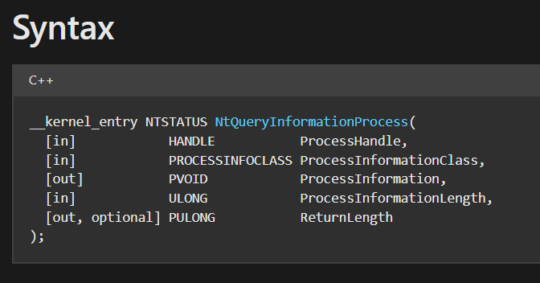
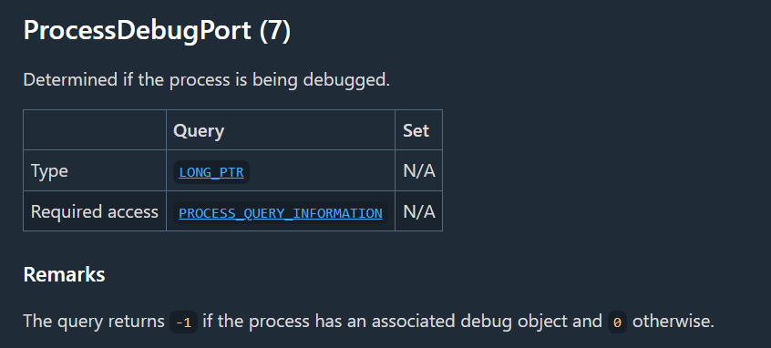
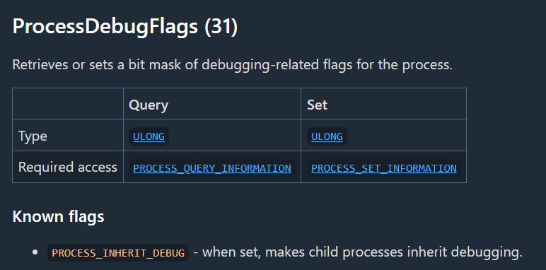

# DEBUG FLAGS
## **[1] `IsDebuggerPresent()` và `PEB!BeingDebugged` Flag**
- Trong cấu trúc của PEB, có 1 trường tên là `BeingDebugged`.

  
- Khi 1 chương trình được tải vào bộ nhớ, giá trị của trường này sẽ được đặt, nếu là giá trị 0 thì chương trình này đang không bị debug và ngược lại.
- Hàm `IsDebuggerPresent()` dựa trên flag `BeingDebugged` để return giá trị 0 (không bị debug) hoặc 1 (đang bị debug).
- Nói cách khác, nếu muốn kiểm tra chương trình có đang bị gắn debugger hay không thì kiểm tra trực tiếp giá trị của trường `BeingDebugged` trong cấu trúc PEB.

> **Code C**: [Detect Debugger C](IsDebuggerPresent/C_language_example/IsDebuggerPresent.c)

> **Code MASM 32bit**: [Detect Debugger MASM](IsDebuggerPresent/IsDebuggerPresent.asm)

## **[2]`NtQueryInformationProcess()`**
- Hàm `NtQueryInformationProcess()` có các tham số như sau:

  

- Hàm này có thể trả về rất nhiều loại thông tin khác nhau từ 1 tiến trình. Hàm này có 2 tham số quan trọng sau:
  - `ProcessInformationClass` là 1 enum tương tự như 1 hằng và có các id riêng gán với từng phần tử trong enum này (chi tiết có thể xem: [PROCESSINFOCLASS](https://ntdoc.m417z.com/processinfoclass)). Ta cần truyền vào id tương ứng để lấy được output mong muốn
  - `ProcessInformation` là output của `ProcessInformationClass`. Giá trị trả về của trường này sẽ phụ thuộc vào `ProcessInformationClass`. Điều đó có nghĩa là chúng ta sẽ cần phải ép kiểu phù hợp để nhận được giá trị trả về.

### ***2.1 ProcessDebugPort***
- Trong `ProcessInformationClass`, `id=7` tương ứng với `ProcessDebugPort`. Trường này sẽ trả về giá trị `-1` nếu chương trình đang bị debug, ngược lại giá trị trả về của nó = `0`.
  
  

- Để nhận giá trị trả về của `ProcessInformationClass`, ta sẽ phải ép kiểu `DWORD` (hay `LONG_PTR`) nếu muốn check debug, vì giá trị trả về `0` hoặc `-1` thuộc kiểu `DWORD`.

### ***2.2 ProcessDebugFlags***
- Tương tự với mục ***2.1***, class `ProcessDebugFlags` có `id=0x1f`. Giá trị trả về thông qua `ProcessInformation` thuộc kiểu `DWORD`.

  

- Nếu giá trị trả về là `0` thì chương trình đang bị debug và ngược lại là giá trị `1`.
- Class này còn liên hệ trực tiếp tới một trường có tên là `NoDebugInherit` (thuộc struct [EPROCESS](https://www.nirsoft.net/kernel_struct/vista/EPROCESS.html)). Trường này mặc định là `1`, có nghĩa là ngăn debugger truyền xuống process con, tương ứng giá trị `ProcessInformation` là `1`, và ngược lại với giá trị `0`.

### ***2.3 ProcessDebugObjectHandle***