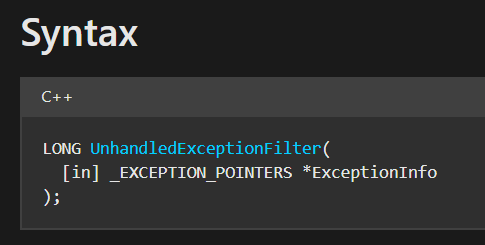
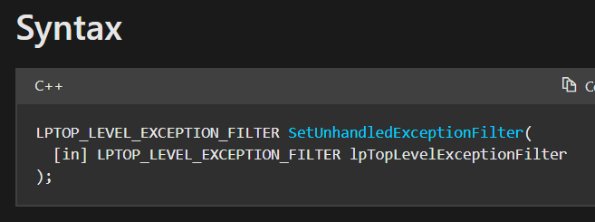
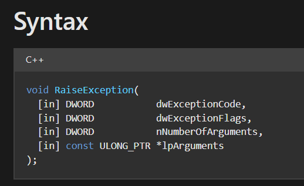
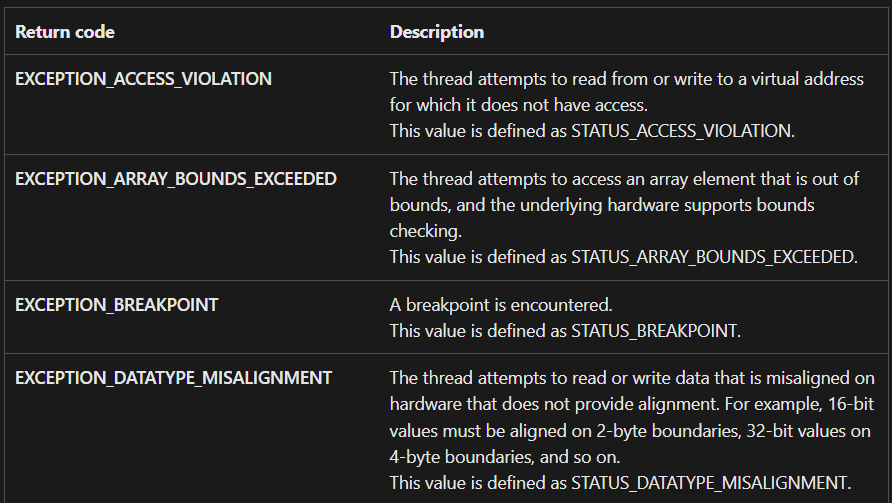

# EXCEPTIONS
Các phương pháp sau đây cố tình gây ra ngoại lệ để xác minh xem hành vi tiếp theo có phải là bình thường đối với một tiến trình không bị debug hay không.
## **[1] `UnhandledExceptionFilter()`**
- Khi có một exception xảy ra và không có exception handler nào được đăng ký (hoặc được đăng ký nhưng không handle 1 exception nào) thì hàm `kernel32!UnhandledExceptionFilter()` sẽ được gọi.
  - Đây là một hàm do ứng dụng định nghĩa, nếu tiến trình đang bị debug, hàm này sẽ chuyển các ngoại lệ chưa được xử lý đến debugger. Ngược lại, nếu không bị debug, nó sẽ hiển thị thông báo "Application Error" và khiến trình xử lý ngoại lệ sẽ được thực thi.
  
    
  - Hàm này trả về 1 trong 2 giá trị như sau:

    | Mã trả về | Mô tả |
    |-----------|-------|
    |`EXCEPTION_CONTINUE_SEARCH` 0x00|Tiến trình đang bị debug, do đó ngoại lệ phải được chuyển tới debugger|
    |`EXCEPTION_EXECUTE_HANDLER` 0x1|Nếu flag `SEM_NOGPFAULTERRORBOX` được chỉ định trong lệnh gọi `SetErrorMode` trước đó, không có thông báo Application Error được hiển thị. Hàm trả lại quyền điều khiển cho trình xử lý ngoại lệ|

- Thay vì xử lý ngoại lệ theo mặc định, chúng ta có thể đăng ký một unhandled exception filter tự custom sử dụng hàm `kernel32!SetUnhandledExceptionFilter()`. Cách hoạt động của hàm này tương đối đơn giản. Mặc định nếu không bị debug thì thông báo "Application Error" được hiển thị, còn hàm kia sẽ giúp chúng ta hiển thị 1 thông báo tuỳ chỉnh theo ý muốn.
- Cách sử dụng hàm này rất đơn giản, chỉ cần truyền vào địa chỉ của hàm custom là được.

  

  > Code: [Anti-debug UnhandedExceptionFilter()](UnhandledExceptionFilter/Anti-debug_UnhandledExceptionFilter.cpp)

## **[2] `RaiseException()`**
  
- Các exceptions như `DBG_Control_C` hoặc `DBG_RIPEVENT` không được chuyển tới exception handlers của process hiện tại và được debugger sử dụng. Điều này cho phép chúng ta đăng ký một trình xử lý ngoại lệ, đưa ra các ngoại lệ này bằng cách sử dụng hàm `kernel32!RaiseException()` và kiểm tra xem điều khiển có được chuyển đến process của chúng ta hay không. Nếu exception handlers không được gọi thì quá trình này có thể đang được gỡ lỗi.
- Để làm được điều này, ta sẽ truyền vào tham số đầu tiên của hàm `RaiseException()` một mã ngoại lệ `DBG_CONTROL_C` hoặc `DBG_RIPEVENT`. Khi hàm này được gọi, tiến trình sẽ kiểm tra ngoại lệ tương ứng, nếu có ngoại lệ xảy ra, nó sẽ so sánh ngoại lệ đó với hàm [GetExceptionCode](https://learn.microsoft.com/en-us/windows/win32/debug/getexceptioncode). Hàm này không có tham số đầu vào và sẽ return ra các mã lỗi ngoại lệ. Dưới đây là một số ngoại lệ với mã lỗi và mô tả tương ứng.

  

- Sau khi kiểm tra xong, nếu đúng mã lỗi ngoại lệ như đã kiểm tra, nó sẽ chạy khối xử lý ngoại lệ sau đó, nếu không sẽ bỏ qua và tìm một exception handler khác.

## **[3] Ẩn luồng điều khiển với Exception Handlers**
- Ở kỹ thuật này, chúng ta sẽ **không detect debugger** mà sẽ **lợi dụng exception handler** để tạo ra các ngoại lệ. Với mỗi ngoại lệ được xử lý sẽ gọi tới một hàm tạo ra các ngoại lệ khác.
- Mục tiêu của kỹ thuật này là để ẩn đi luồng thực thi cũng như đoạn chương trình thực sự được thực hiện.
- Kỹ thuật này chủ yếu gây rối debugger và tránh phân tích tĩnh:
  - Code không có `jmp`, không có `call`, không có `if`.
  - Control flow diễn ra qua exception.
  - Debugger step-by-step sẽ khó trace hoặc miss logic thật.
