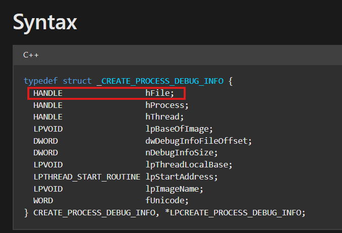

# OBJECT HANDLES
## **[1] `OpenProcess()`**
- Một số debuggers có thể bị detect với hàm `OpenProcess()`.
- Cơ chế hoạt động của dạng anti-debug này là chương trình sẽ cố gắng mở process `csrss.exe` bằng `OpenProcess()`. Process này là một tiến trình hệ thống, thông thường chỉ có thể mở với quyền Admin. Mặt khác, chỉ khi **bị debug**, quyền `SeDebugPrivilege` được bật bởi 1 số debugger thì mới thành công, ngược lại nó sẽ mặc định bị tắt.
- Điều đó có nghĩa là nếu tiến trình `csrss.exe` được mở thành công bởi `OpenProcess()` (nói cách khác, `OpenProcess()` trả về giá trị khác `NULL`) thì trình debugger sẽ bị phát hiện.
- Tuy nhiên, nếu không debug nhưng lại chạy dưới quyền Admin thì hàm `OpenProcess()` vẫn không thành công do không được bật quyền `SeDebugPrivilege`.

## **[2] `CreateFileA()`**
- Khi một debugger (như OllyDbg, x64dbg, WinDbg...) khởi chạy một tiến trình để debug, Windows sẽ tạo ra một loạt các sự kiện debug (`DEBUG_EVENT`). Một trong những sự kiện đầu tiên là: `CREATE_PROCESS_DEBUG_EVENT`
- Khi sự kiện này xảy ra, hệ thống sẽ gửi thông tin đến debugger dưới dạng một cấu trúc gọi là `CREATE_PROCESS_DEBUG_INFO`.

  

- Trong cấu trúc này có một trường rất quan trọng là `HANDLE hFile`. Đây là handle của file thực thi của tiến trình đang bị debug.
- Handle này có thể lấy từ return value của hàm `CreateFileA()`. Vì debugger giữ `hFile` này mở trong suốt quá trình debug, nên nếu chương trình đang bị debug cố mở lại chính file EXE của nó với quyền "exclusive access" (`dwShareMode` = 0), thì Windows sẽ không cho mở và trả về lỗi.
- Nếu lệnh này trả về `INVALID_HANDLE_VALUE`, thì khả năng rất cao là một tiến trình khác (trình debugger) đang giữ handle mở với quyền truy cập chia sẻ, khiến chương trình không thể mở độc quyền chính nó.

## **[3] `CloseHandle()`**
- Kỹ thuật này mô tả cách một chương trình khi không bị debug sẽ luôn có khả năng trả ra lỗi ngoại lệ khi gặp một giá trị không hợp lệ. Với một số trình debugger có thể cho ra các giá trị "giả" hợp lệ và lợi dụng điều này có thể detect được debugger.
- Ở đây, hàm `CloseHandle()` sẽ được gọi với một handle bất kỳ. Đương nhiên handle này có thể không tồn tại trong quá trình chương trình được thực thi nên nó sẽ trả về lỗi handle không hợp lệ `EXCEPTION_INVALID_HANDLE`.
- Nếu chương trình chạy bình thường thì ngoại lệ này sẽ bị bắt và thực hiện các câu lệnh xử lý ngoại lệ này. Lúc này ta sẽ đánh dấu đây không phải chương trình đang bị debug. Ngược lại, một số trình debugger sẽ trả về các giá trị "giả" hợp lệ khiến cho việc xử lý ngoại lệ không được xử lý, từ đó có thể kết luận chương trình đang bị debug.