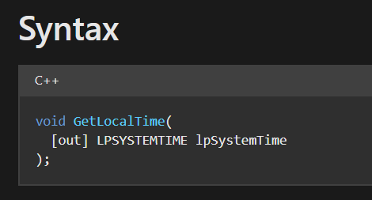

# TIMING
Thực tế khi đang debug, luôn luôn có 1 khoảng delay khá lớn (so với thời gian chạy chương trình trung bình) giữa các câu lệnh và trình thực thi. Dựa vào cách tiếp cận này có thể phát hiện được chương trình đang bị debug hay không.

## **[2] `GetLocalTime()`**
- Ý tưởng tổng quát: Debugger (đặc biệt là debug step-by-step hoặc breakpoints) thường làm chương trình chạy chậm hơn do phải dừng lại, ghi nhận trạng thái, phân tích từng dòng. 
--> Kỹ thuật Timing sử dụng `GetLocalTime()` đo thời gian trôi qua giữa hai điểm trong chương trình để phát hiện bất thường bằng cách:
  - Ghi nhận thời gian trước và sau một đoạn code.
  - Nếu chênh lệch vượt ngưỡng cho phép thì sẽ nghi ngờ debugger.

- Hàm `GetLocalTime()` nhận vào 1 đối số là con trỏ tới biến kiểu [LPSYSTEMTIME](https://learn.microsoft.com/en-us/windows/win32/api/minwinbase/ns-minwinbase-systemtime). Đây là 1 struct chứa tất cả các đơn vị thời gian (năm, tháng, ngày trong tuần, ngày, giờ, phút, giây, mili giây)

  