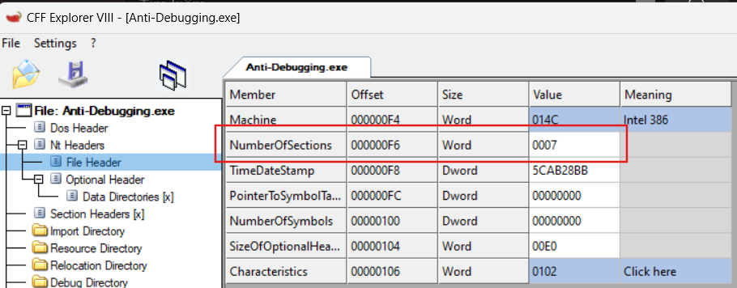

# WriteUp Anti-Debugging

## **[1] Ý tưởng chung:**
- Nếu chạy chương trình thì hên xui sẽ nhận được flag ngay, nhưng khả năng cực kỳ thấp

  
  

- Do đó, ý tưởng của chương trình này là buộc **phải debug** và đi qua các case xử lý sẽ được phân tích ở phần sau

## **[2] Phân tích**
### **2.1 `TlsCallback_0()`**
- Focus vào hàm `TlsCallback_0()`
  
  

- Ở đây tôi đã đổi lại tên biến cho dễ follow, có thể thấy biến `num_of_times` phải ít nhất bằng `18` thì mới có thể hiển thị flag đúng. Biến này chỉ có thể được tăng khi hàm `TlsCallback_0()` được gọi. Nhưng làm sao để có thể gọi hàm này nhiều lần trong 1 chương trình?
- Được biết các hàm `TlsCallback()`chỉ có thể được gọi khi 1 tiến trình được tạo ra. Như vậy câu trả lời là tạo ra các tiến trình trong quá trình chạy chương trình này!
- Tiếp theo, trong hàm `TlsCallback_0()` này có một kỹ thuật anti-debug đơn giản, tìm các byte `0xCC` tương ứng với **opcode `int 3`** hay chính là breakpoint khi debug.

  

- Vùng nhớ mà đoạn code này kiểm tra chính là vùng nhớ `.text`
  - `a1` có thể coi là offset của **Dos Header** => `a1 + 0x3C` đang trỏ tới trường `e_lfanew`

    

  - Có thể thấy giá trị tại trường này là `0xF0`, chính là offset của **Nt Header** hay chính là **Signature** của file PE
    
    

  - Giá trị của **Signature** là `0x4550` chính là little endian của `PE` - signature của file PE.
- Ở dòng code `pPE_Header = a1 + *(_DWORD *)(a1 + 0x3C) + 0xF8;` chỉ lấy giá trị của trường `e_lfanew` chính là `*(_DWORD *)(a1 + 0x3C)` = `0xF0`, giá trị này cộng với `0xF8` sẽ ra địa chỉ của **Section Headers**, đối với chương trình này thì giá trị của nó là **`0x1E8`**. Tại đây chứa tất cả các section như `.text`, `.rdata`,...

  

- Tuỳ từng chương trình mà các section có thể không theo thứ tự như hình bên trên, nên phải có 1 vòng lặp để lặp qua số lượng các section này để tìm kiếm đúng section `.text`

  

  - Ở đây, `*(unsigned __int16 *)(*(_DWORD *)(a1 + 0x3C) + a1 + 6)` chính là số lượng các section có trong file PE này (`0xF0 + a1 + 6` = `a1 + 0xF6` => giá trị tại địa chỉ này là `NumberOfSections`)

    

- Sau đó nó lần lượt kiểm tra **Characteristics** của từng section, trường này nằm ở offset `0x24` tính từ đầu section đó

  

  - Dựa vào bảng các section trên, có thể thấy nếu **Characteristics** = `0x60000020` thì đây là trường `.text`
- Sau đó chương trình này lặp với số lần đúng bằng số byte có trong section `.text`, số byte đó được lưu ở địa chỉ `8` tính từ offset của section này. Ở bên trên ta đã tính được offset của **Section Headers** là `0x1E8`, và section `.text` ở ngay đầu của header này nên ta sẽ cộng tiếp với `8` = `0x1F0` để xác định số byte của section này, và giá trị của nó chính là `0x1AA3`
  
  

  

  - Ở vòng lặp trên, chương trình đếm số lượng các byte `0xCC` và `0x90` ở trong section `.text`. Mà chương trình này là phần chứa code được thực thi. Có nghĩa là khi debug mà đặt breakpoint tại bất kỳ chỗ nào trong code cũng có thể bị tính vào biến `cnt_0xCC`. Vì thế, khi debug chương trình này, chúng ta cần đếm chính xác số lượng breakpoint đã đặt để trừ cho phù hợp
  - Còn byte `0x90` có thể là 1 biến, có thể là lệnh nop, tuy nhiên khi nop để bypass kỹ thuật anti-disassembly thì nó không bị ảnh hưởng đến số byte `0x90` thực sự
  - Kết quả sau khi tự đếm trong HxD hoặc debug chương trình thì các giá trị này lần lượt là:
    - `cnt_0xCC = 0x81`
    - `cnt_0x90 = 0x07`

- Đoạn sau, chương trình sử dụng kỹ thuật anti-debug - `Timing rdtsc` để tính toán thời gian thực thi, từ đó biến đổi dữ liệu theo 2 cách khác nhau.
  
  

  - Đầu tiên, từng khối 4 byte của flag được xor với giá trị của biểu thức `(cnt_0x90 << 16) ^ cnt_0xCC` chính là bằng `0x70081`
  - Nếu thời gian lớn hơn `0xDEADBEEF` thì 8 block của flag sẽ lần lượt được xor với thời gian thực thi tính được. Ngược lại, nó sẽ được xor trực tiếp với `0xDEADBEEF`. Mặc định, 1 chương trình nhỏ như này không thể nào chạy với thời gian lớn hơn giá trị `0xDEADBEEF` nên các khối này sẽ được xor với `0xDEADBEEF`

### **2.2 `main()`**

- Hàm này chỉ có mục đích duy nhất là tạo 8 thread với hàm WinAPI `CreateThread()` để thực thi hàm `CallCatchBlock()`. Hệ quả của việc tạo 8 thread đó là hàm `TlsCallback()` sẽ được thực thi
- Số lần gọi `TlsCallback()` được tính như sau:
  - Khi chương trình vừa được tải vào bộ nhớ để chuẩn bị thực thi, `TlsCallback()` được gọi 1 lần với tham số `DLL_PROCESS_ATTACH`
  - Ngay sau khi vừa được load vào bộ nhớ, main thread sẽ tiếp tục gọi `TlsCallback()` với tham số `DLL_THREAD_ATTACH` => 1 lần gọi
  - Khi 8 thread mới được tạo, nó sẽ truyền tham số là 1 giá trị `DLL_THREAD_ATTACH` => 8 lần gọi `TlsCallback()`
  - Sau khi 8 thread trên thực thi xong sẽ thoát ra, lúc này hàm `TlsCallback()` lại được gọi với tham số `DLL_THREAD_DETACH` => 8 lần gọi `TlsCallback()`
  - Thoát main thread => 1 lần gọi `TlsCallback()` với tham số `DLL_THREAD_DETACH`
  - Chương trình thực thi xong, hàm `TlsCallback()` được gọi với tham số `DLL_PROCESS_DETACH`
- Như vậy, tổng cộng hàm `TlsCallback()` có thể được gọi tối đa 20 lần, tuy nhiên, chỉ cần được gọi 18 lần là nó có thể in ra flag như mong muốn, lần thứ 18 tương ứng là các lần từ khi bắt đầu được thực thi cho đến khi thoát hết 8 thread được tạo trên

### **2.3 `CallCatchBlock()`**


- Ở phần đầu của hàm `CallCatchBlock()` sẽ gọi hàm Windows API `NtSetInformationThread()` và truyền vào tham số `ThreadHideFromDebugger` (`0x11`), tham số này giúp cho thread hiện tại có thể ẩn khỏi trình debugger, khiến cho việc debug có thể bị kẹt khi hàm `NtSetInformationThread()` được gọi
- Phần tiếp theo là các case xử lý lần lượt tương ứng với giá trị trả về của phép chia lấy dư, và nó có 8 case xử lý trong 1 vòng lặp

  

  

### **2.4 Các case xử lý**


- Ở phần này, có 8 case xử lý flag, dựa trên giá trị số dư khi lấy 1 số random chia cho 8

### **[+]** Case 0: `checkDebuggerPresent_WinAPI()`
  
  

  - Ở kỹ thuật anti-debug này, nó chỉ có 1 luồng biến đổi flag duy nhất là ở dòng `*a1 ^= 0x676F6E65u;`, có nghĩa là ta sẽ phải bypass toàn bộ các lệnh rẽ nhánh để return 0 phía trên
  - Tất cả các hàm Windows API được sử dụng như `IsDebuggerPresent()` hay `CheckRemoteDebuggerPresent()` đều phải trả về giá trị `1` mới có thể bypass được
  - Điều đó có nghĩa là chỗ này buộc phải debug, nếu chạy chương trình bình thường và không debug thì khi đi qua hàm này sẽ mặc định bị return 0 và flag sẽ có đoạn không bị thay đổi

  > **key_case0 = 0x656E6F67**

### **[+]** Case 1: `checkDebugger_CreateToolhelp32Snapshot()`

  

  - Hàm này kiểm tra tất cả cửa sổ đang mở bằng cách chụp toàn bộ các tiến trình đang hoạt động thông qua hàm `CreateToolhelp32Snapshot()` và dò tìm chính xác các debugger "windbg", "ollydbg", "ida", "x32dbg"
  - Nếu chỉ mở duy nhất 1 debugger, thì key để xor chỉ có 1 trong các key tương ứng như trong ảnh. Nhưng với 1 block của flag có 4 byte thì dự đoán key của hàm này cũng sẽ là 4 byte. Có nghĩa là cần phải mở đúng 4 debugger kể trên

  > **key_case1 = 0x776F6978**

### **[+]** Case 2: `checkDebugger_FindWindowA()`


  - Case này cũng tương tự với case 1 trước đó, nó sẽ tìm các cửa sổ được mở "WinDbgFrameClass", "OLLYDBG", "QtQWindowIcon", "X64DBG"
  - Tuy nhiên, điểm khác biệt ở case này là không được phép có 4 debugger kể trên thì nó mới biến đổi giá trị của khối flag được truyền vào

  > **key_case2 = 0x574F4958**

### **[+]** Case 3: `checkDebugger_GetThreadContext()`


  - Với case này, chương trình sẽ tự động đặt hardware breakpoint. Để bypass được điều kiện `if ( !Context.Dr0 || !Context.Dr1 || !Context.Dr2 || !Context.Dr3 )` thì tất cả 4 thanh ghi `Dr0-3` đều phải được bật
  - Mục tiêu của hàm này là phải đặt đúng 4 hardware breakpoint thì mới có thể bypass được và xor với key và return 1

  > **key_case3 = 0x68617264**

### **[+]** Case 4: `checkDebugger_NtQueryInformationProcess()`


  - Hàm này so sánh ID của thread hiện tại có bằng với ID của `explorer.exe` hay không, nếu bằng thì nó sẽ trả về 1 và block 4 byte flag được truyền vào sẽ không có thay đổi. Ngược lại nó xor với giá trị `dwProcessId ^ InheritedFromUniqueProcessId`

    
  
  - Giá trị xor này còn phụ thuộc vào PID khi chương trình được chạy nên không thể có được giá trị key chính xác nên phần này tạm thời không xét tới

### **[+]** Case 5: `checkDebugger_NtCurrentPeb()`

  
  - Hàm này kiểm tra debugger bằng debug flag `BeingDebugged`, `NtGlobalFlag` và `ProcessHeap`
  - Nếu có debugger, block 4 byte flag sẽ được xor với 1 số nguyên 4 byte và return 1

  > **key_case5 = 0x21626570**

### **[+]** Case 6: `checkDebugger_int2D()`


  - Hàm này kiểm tra debugger bằng cách gây exception bằng lệnh ngắt assembly `int 2D`.
  - Có thể thấy nếu có debugger thì giá trị xor sẽ là `0x65757274`, còn exception sẽ cho giá trị xor là `0x6C6C756E`. Khi xor lần lượt 2 key này với tất cả các khối flag sẽ nhận được 1 khối có ý nghĩa nên cả 2 key sẽ được sử dụng

  > **key_case6 = 0x6C6C756E<br>**
    **key_case6_2 = 0x65757274**

### **[+]** Case 7: `checkDebugger_CreateFileA()`

  
  - Hàm này check debugger bằng cách dùng hàm `CreateFileA()`
  - Nếu hàm `CreateFileA()` thực thi không thành công thì chương trình này đang bị debug và kết quả trả về là `-1`, tương ứng với số hex là `0xFFFFFFFF`

  > **key_case7 = 0xFFFFFFFF**
## **[3] Solve**
- Vì các case đều random và yêu cầu phải debug với các cách riêng biệt, hơn nữa các key đều đã có sẵn, nên chúng ta không cần thiết phải debug, mặc dù ý tưởng ban đầu là thế
- Cách solve là lấy các key và xor với tất cả các block 4 byte của flag và tìm xem block nào có cả 4 ký tự đều đọc được thì đó chính là key tương ứng của block đó
  ```
  cipher = [0x6ab4a0c7, 0x72b7b7d4, 0x349da1da, 0x3a94ecc4, 0xe5700a45, 0x38b2b080, 0x6694a3b3, 0x179f8ba3]
  key_tlscallback = 0x81000700 ^ 0xEFBEADDE
  key_case0 = 0x656E6F67
  key_case1 = 0x776F6978
  key_case2 = 0x574F4958
  key_case3 = 0x68617264
  key_case5 = 0x21626570
  key_case6 = 0x6C6C756E
  key_case6_2 = 0x65757274
  key_case7 = 0xFFFFFFFF

  for i in range(len(cipher)):
      cipher[i] ^= key_tlscallback    # 7 b'y!!}'
      # cipher[i] ^= key_case0          # 5 b'3bu9'
      # cipher[i] ^= key_case1          # 0 b'seca'
      # cipher[i] ^= key_case2          # 6 b'_e@5'
      # cipher[i] ^= key_case3          # 1 b'thon'
      # cipher[i] ^= key_case5          # 2 b'{Ant'
      # cipher[i] ^= key_case6
      # cipher[i] ^= key_case6_2        # 3 b'1_4n'
      # cipher[i] ^= key_case7          # 4 b't1_d'
      print(i, cipher[i].to_bytes(4, 'big'))

  # flag: seca thon {Ant 1_4n ti_d 3bu9 _e@5 y!!}
  # Case:  1    3    5   6_2   7    0    2    -1
  ```
> **flag:** `secathon{Ant1_4nti_d3bu9_e@5y!!}`
## **[4] Tham khảo**
- **TlsCallback:** Cuốn Windows Internals Part 1, Pavel Yosifovich, Alex Ionescu, Mark E. Rusinovich, David A. Solomon