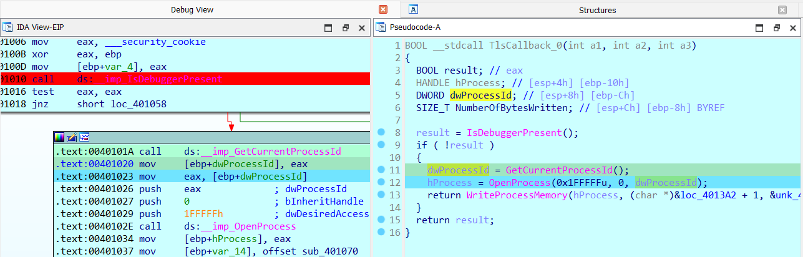

# Replace.exe
## **[1] Phân tích**
- Khi load file PE vào IDA ta sẽ thấy có hàm `main()` khá clear như sau:
  
  

- Mô tả từng phần được đóng khung đỏ:
  - Dòng 12 khởi tạo key cho quá trình mã hoá
  - Dòng 18-20 yêu cầu người dùng nhập `input`
  - Dòng 23-28 thêm padding `'\n'` nếu `len(input)` không chia hết cho 8
  - Dòng 29-40 kiểm tra input nhập vào có đúng `flag` hay không
- Hàm mã hoá được gọi ở dòng 31, truyền vào `Buffer` (hay input) và `key`, hàm này mã hoá xor cơ bản như sau:
  
  

  - Truyền tham chiếu `Buffer` và `key`, ép sang kiểu _DWORD 4 byte.
  - Với mỗi block 4 byte của `Buffer` được xor với tổng 2 block 4 byte liền kề của `key`.
- **Tuy nhiên đây chỉ là 1 hàm mã hoá giả!**
- Mở bảng **entry point** sẽ thấy phần code của chương trình được bắt đầu ở hàm `TLSCallback_0()` chứ không phải `main()`. Trong 1 số trường hợp, malware có thể xuất hiện ở các hàm `TLSCallback()` này khiến người phân tích không phát hiện và có thể vô tình cho phép malware chạy nếu được debug. Vì thế ta cần phân tích hành vi của `TLSCallback_0()` trước.

  

  

- Mục đích của hàm này là `detect debugger` bằng Windows API đơn giản là `IsDebuggerPresent()`.
- Nếu chương trình đang bị debug, luồng chương trình sẽ tuyến tính theo đoạn phân tích hàm `main()` và hàm mã hoá như trên.
- Tuy nhiên, khi không bị debug, nó sẽ gọi API `WriteProcessMemory()` để ghi vào vùng nhớ đã chỉ định các byte khởi tạo sẵn để chuyển luồng chương trình.
  - Vùng nhớ được chỉ định đó chính là lệnh call (trong hàm main) để gọi tới hàm mã hoá. Lệnh call này có các byte `E8 D9 FD FF FF` với `E8` là opcode của lệnh call, còn 4 byte còn lại là offset của **hàm mã hoá giả**.

    

  - Nếu chương trình không detect được debugger, 4 byte offset trên sẽ được thay thế bởi 4 byte offset của **hàm mã hoá thật** là `C9 FC FF FF`.
- Để có thể biết được **hàm mã hoá thật** có những lệnh gì thì ta có thể debug. Breakpoint sẽ được đặt ở chỗ gọi hàm `IsDebuggerPresent()` để tránh anti-debug và chỗ gọi hàm mã hoá để xem sự thay đổi của chương trình. Sau đó tiến hành debug chương trình.
  - Nhấn F8 để gọi qua hàm `IsDebuggerPresent()` và check giá trị trả về qua thanh ghi `eax`

    

  - Lúc này do chương trình đang bị debug nên giá trị thanh ghi `eax` là `1`, ta sửa thành `0` để chuyển luồng

    

    

  - Chạy chương trình tới chỗ đặt breakpoint tiếp theo để xem sự thay đổi sau khi đã ghi đè vùng nhớ. `input` được yêu cầu nhập vào thì có thể nhập 1 chuỗi ký tự 'a' với độ dài bất kỳ.
    
    

  - Lúc này, hàm thật sự được gọi là một hàm khác, mặc dù pseudocode vẫn hiển thị **hàm mã hoá giả**.
  - **Hàm mã hoá thật** có logic như sau:
    
    
  
## **[2] Solve**
- **Hàm mã hoá thật** chính là thuật toán mã hoá **TEA (Tiny Encryption Algorithm)**, tham số truyền vào vẫn là `Buffer` và `key`.
- Sử dụng python để giải mã thuật toán này sẽ có được flag:
  
  ```
  def decrypt_tea(encrypted_buffer, key):
      import struct
      result = []
      
      k = []
      for i in range(0, len(key), 4):
          k_bytes = key[i:i+4].ljust(4, b'\0')
          k_val, = struct.unpack("<I", k_bytes)
          k.append(k_val)
      
      for j in range(0, len(encrypted_buffer), 8):
          if j + 8 <= len(encrypted_buffer):
              chunk = bytes(encrypted_buffer[j:j+8])
              v0, v1 = struct.unpack("<II", chunk)
              
              delta = 0x9E3779B9
              sum_val = (delta * 32) & 0xFFFFFFFF
              
              for i in range(32):
                  v1 = (v1 - ((k[3] + (v0 >> 5)) ^ (sum_val + v0)   ^ (k[2] + (v0 << 4)))) & 0xFFFFFFFF
                  v0 = (v0 - ((k[1] + (v1 >> 5)) ^ (sum_val + v1)   ^ (k[0] + (v1 << 4)))) & 0xFFFFFFFF
                  sum_val = (sum_val - delta) & 0xFFFFFFFF
              
              result.extend(struct.pack("<II", v0, v1))
      
      return result
  
  Buf2 = [
      0x19, 0x2C, 0x30, 0x2A, 0x79, 0xF9, 0x54, 0x02, 0xB3, 0xA9, 
      0x6C, 0xD6, 0x91, 0x80, 0x95, 0x04, 0x29, 0x59, 0xE8, 0xA3, 
      0x0F, 0x79, 0xBD, 0x86, 0xAF, 0x05, 0x13, 0x6C, 0xFE, 0x75, 
      0xDB, 0x2B, 0xAE, 0xE0, 0xF0, 0x5D, 0x88, 0x4B, 0x86, 0x89, 
      0x33, 0x66, 0xAC, 0x45, 0x9A, 0x6C, 0x78, 0xA6
  ]
  
  key = b"VdlKe9upfBFkkO0L"
  
  decrypted = decrypt_tea(Buf2, key)
  
  ascii_result = ""
  for b in decrypted:
      if 32 <= b <= 126:
          ascii_result += chr(b)
      else:
          ascii_result += "."
  
  print("Decrypted text (ASCII):", ascii_result)
  
  c_string = bytes(decrypted).decode('utf-8', errors='replace')
  print(c_string)
  # Decrypted text (ASCII): PTITCTF{bdc90e23aa0415e94d0ac46a938efcf3}.......
  # PTITCTF{bdc90e23aa0415e94d0ac46a938efcf3}
  ```

  

> **Flag:** `PTITCTF{bdc90e23aa0415e94d0ac46a938efcf3}`