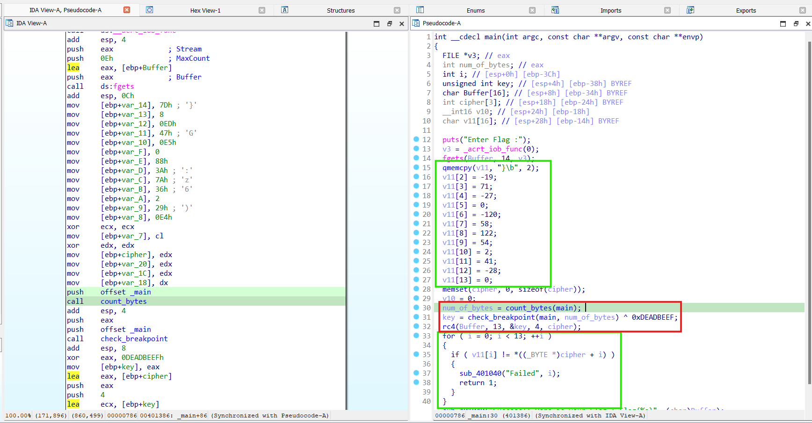
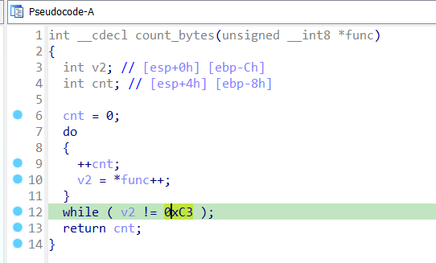
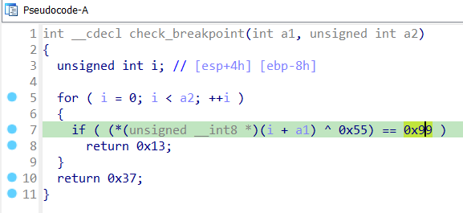
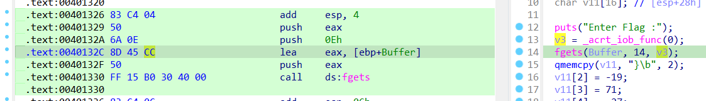
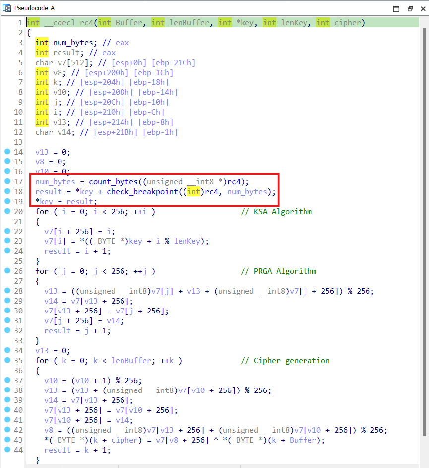
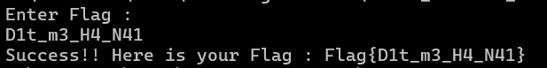
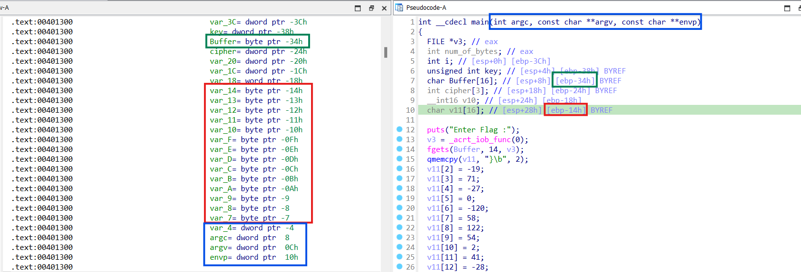
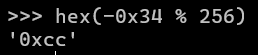
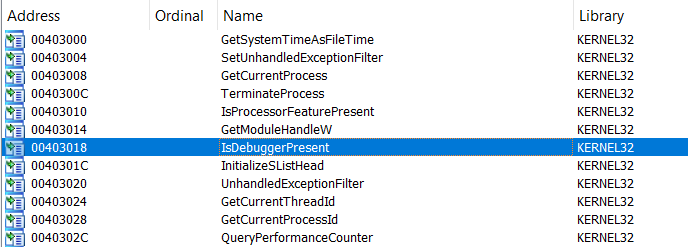
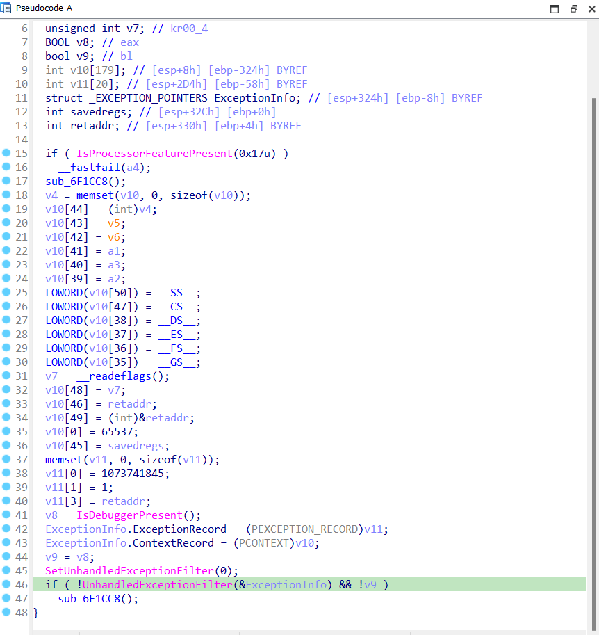

# WriteUp ThitNhi.exe
## **[1] Phân tích**
- Đọc lướt qua một cách tổng quan có thể nhận thấy luồng chương trình chính như sau:

  

- Mảng `v11[]` chính là `ciphertext` của `flag`, được đóng khung màu xanh.
- Luồng chương trình chính là 3 dòng 30-32. Ở phần này sẽ đề cập đến 1 số opcode thông dụng (chi tiết các opcode có thể xem tại [X86 Opcode and Instruction Reference](http://ref.x86asm.net/coder32.html#x8D)):
  - Dòng 30 đếm số lượng bytes tính từ đầu hàm main đến khi gặp opcode của lệnh `ret` là `0xC3`.

    

  - Dòng 31 thiết lập 1 `key` "chưa hoàn chỉnh" sử dụng trong quá trình mã hoá `Buffer`. Trước khi xor với `0xDEADBEEF`, nó cần lấy 1 byte được return từ hàm `check_breakpoint()`.

    

  - Hàm này thực chất đang detect debugger dựa theo technique [INT3 Assembly Instructions](https://anti-debug.checkpoint.com/techniques/assembly.html#int3). Nó sẽ quét tất cả các byte của hàm được truyền vào và tìm xem có byte `0xCC` (opcode của lệnh asm INT3) hay không. Nếu có, lập tức return `0x13`, nếu không thì sẽ return `0x37`.
  - Quay trở lại cửa sổ IDA View-A, bật chế độ text view để xem các opcode của các lệnh asm, thấy luôn luôn có byte `0xCC` (lý do sẽ được đề cập chi tiết hơn ở phần **[3] Tìm hiểu thêm**).

    

  - Vì nó luôn luôn có byte `0xCC` trong hàm `main()` nên hàm `check_breakpoint()` sẽ luôn trả về giá trị `0x13`.
    > Đến đây `key` mã hoá nhận được là `0xDEADBEFC`.
  - Tiếp theo, ta đi phân tích hàm `rc4()` - hàm mã hoá `Buffer`.

    

  - Vì `rc4` là thuật toán tương đối quen thuộc nên logic mã hoá không có gì phải bàn thêm.
  - Thứ cần quan tâm nhất chính là quá trình tạo `key` phía trên chưa hoàn tất, vì ở trong hàm `rc4()`, `key` vẫn còn tiếp tục tạo theo 1 cách quen thuộc - kiểm tra sự tồn tại của byte `0xCC` của chính hàm `rc4()`.
  - Thông qua quá trình thử nghiệm đặt breakpoint và không đặt breakpoint ở hàm `rc4()` này, ta có thể nhận thấy các byte của hàm này không có byte nào là `0xCC`, nghĩa là khi đặt breakpoint thì mới có `0xCC`, lúc này hàm `check_breakpoint()` sẽ lập tức trả về giá trị `0x13` như trên, dẫn đến `key` nhận được cuối cùng sẽ bị sai.
  - Theo logic phân tích tĩnh thì giá trị đúng phải trả về ở đây là `0x37`.
    > Đến bước này `key` mã hoá đã được tạo thành công, đó là `0xDEADBF33`.
  
## **[2] Solve**
- Sau khi đã có được `key` và `cipher`, ta có thể dễ dàng reverse lại để tìm `plaintext`.
- Do rc4 là thuật toán mã hoá đối xứng, nên chúng ta có thể sử dụng luôn code mã hoá này, truyền `cipher` và `key` thì ouput chính là `plaintext`.
- Sau đây ta có thể dùng python để giải mã `cipher`.
    ```
    def rc4_init(key: bytes) -> list:
        S = list(range(256))
        j = 0
        for i in range(256):
            j = (j + S[i] + key[i % len(key)]) % 256
            S[i], S[j] = S[j], S[i]
        return S

    def rc4_crypt(data: bytes, key: bytes) -> bytes:
        S = rc4_init(key)
        i = j = 0
        result = bytearray()
        for byte in data:
            i = (i + 1) % 256
            j = (j + S[i]) % 256
            S[i], S[j] = S[j], S[i]
            t = (S[i] + S[j]) % 256
            k = S[t]
            result.append(byte ^ k)
        return bytes(result)

    key = bytes([0xde, 0xad, 0xbf, 0x33][::-1])
    plaintext = bytes([0x7D, 0x08, 0xED, 0x47, 0xE5, 0x00, 0x88, 0x3A,
                    0x7A, 0x36, 0x02, 0x29, 0xE4])

    plaintext = rc4_crypt(plaintext, key)
    print("Plaintext (hex):", plaintext.hex(' '))
    print("Plaintext (raw):", plaintext)
    ```
  > **Kết quả:**<br>Plaintext (hex): 44 31 74 5f 6d 33 5f 48 34 5f 4e 34 31<br>Plaintext (raw): b'D1t_m3_H4_N41'
- Nhập plaintext vào input:
  
  

> **Flag:** `Flag{D1t_m3_H4_N41}`
## **[3] Tìm hiểu thêm**
### **3.1. `main()` có `0xCC` còn `rc4()` thì không**
- IDA đang thực hiện **stack variable recovery**, nó sử dụng thanh ghi/stack để suy ra vị trí, loại, và tên tạm thời cho biến cục bộ và tham số của hàm.
- Ta có thể thấy ở hàm `main()` các biến được khai báo ở phần đầu của hàm như sau:
  
  

- Đối với các tham số truyền vào (theo quy tắc gọi hàm calling convention) thì các vị trí của các **tham số** được biểu thị là số **dương**.
- Đối với các **biến** được sử dụng trong hàm, khi khai báo ở đầu hàm thì vị trí trong stack sẽ được biểu thị bởi số **âm**, tuy nhiên nó chỉ có 1 byte nên nó sẽ bị đảo ngược lại (sử dụng mã hex để hiển thị)

  

- Điều mà tôi muốn nói ở đây là khi tạo ra chương trình này, lập trình viên đã khéo léo sắp xếp thứ tự khai báo các biến tương ứng với các kiểu dữ liệu phù hợp, sao cho 1 biến nào đó có vị trí `0xCC` trong stack.<br> ==> Vậy việc khai báo như trên có ý nghĩa như thế nào trong chương trình này?
- Quay trở lại với byte `0xCC` đã đề cập ở trên:
  
  

- Ở đây các mã máy của dòng lệnh này lần lượt là:
  - `8D` tương ứng opcode của lệnh `lea`
  - `45` là thanh ghi `eax`
  - `CC` là địa chỉ của biến `Buffer` đã được khai báo ở đầu hàm `main()`.
- Như vậy hàm `main()` luôn tồn tại ít nhất 1 byte `0xCC`.
- Tương ứng, ở hàm `rc4()` không có byte nào tương tự như vậy nên chỉ khi có đặt breakpoint mới bị phát hiện.

### **3.2. Các hàm WindowsAPI được gọi**
- Mở phần import trong IDA sẽ thấy có 1 số hàm Windows API đặc trưng cho kỹ thuật anti-debug.

  

- Tuy nhiên, khi xref tới các hàm này, không thấy có dấu hiệu anti debug, thay đổi luông chương trình hay bất cứ 1 sự thay đổi nào, mà nó đơn giản chỉ đăng ký 1 ExceptionFilter, đồng thời kiểm tra với hàm `IsDebuggerPresent()` và thay đổi giá trị của 1 biến.

  

  ==> Điều đó có nghĩa là kỹ thuật anti-debug chỉ được sử dụng bởi trick `INT3`.