# WriteUp anti3

## **[1] Nhận xét**
- Nhận định ban đầu cho thấy chương trình được yêu cầu chạy dưới quyền Administrator
  
  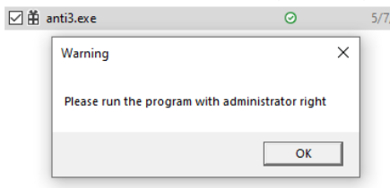

- Khi chạy với quyền Admin, nó yêu cầu nhập key, nếu đúng, nó sẽ in ra flag và sai thì hiển thị messagebox thông báo fail

  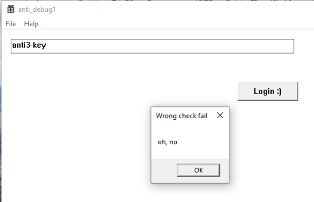

## **[2] Phân tích**
- Kiểm tra thấy entry point của chương trình này bắt đầu tại hàm `TlsCallback_0()`
### **2.1 `TlsCallback()`**
Sau khi debug qua 2 hàm được gọi trong `TlsCallback_0()` ta có thể kết luận về các hành vi của hàm này như sau:
- Đầu tiên gọi hàm `Get_Base_Addr_ntdll()` để lấy địa chỉ của thư viện `ntdll.dll`
- Sau đó tìm trong thư viện `ntdll.dll` để lấy địa chỉ hàm `NtQueryInformationProcess()` thông qua hàm `Get_Proc_Address()` tương tự với hàm WindowsAPI `GetProcAddress()`
- Khi lấy được địa chỉ của hàm này, chương trình tiến hành gọi và thực thi hàm này với tham số `ProcessInformationClass = 7` tương ứng với `ProcessDebugPort` để kiểm tra sự tồn tại của debugger

  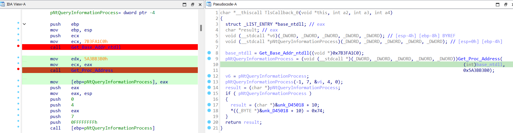

- Nếu phát hiện chương trình đang bị debug, nó sẽ thay đổi giá trị tại byte thứ 10 tính từ địa chỉ của biến `unk_D45018`
  
  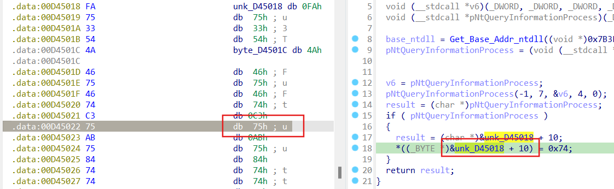

### **2.2 `WinMain()`**
- Ở hàm `WinMain()`, có đoạn yêu cầu chạy chương trình dưới quyền Aministrator:

  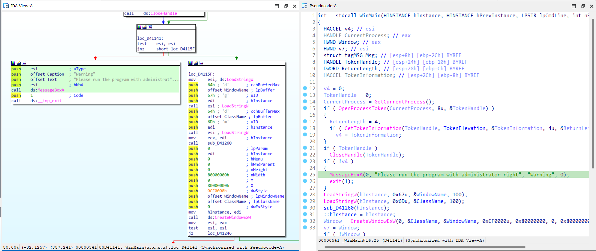

- Ngay phía dưới, chương trình này đăng ký một cửa sổ hiển thị với hàm `Register_Class_Window()`
  
  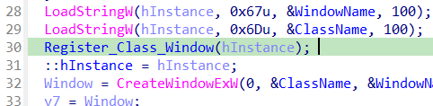

- Tại đây, có 1 hàm xử lý thông điệp cho cửa sổ GUI, `MainWindowProc()`

  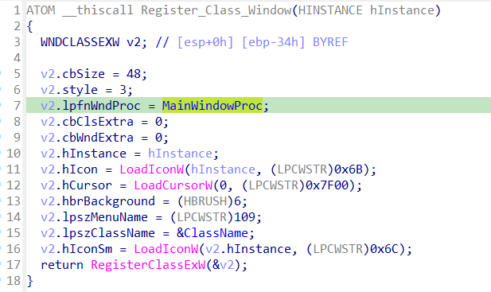

- Trong hàm này, ta có thể focus vào luồng thực thi chính, đó là tại hàm `mainflow()` được gọi

  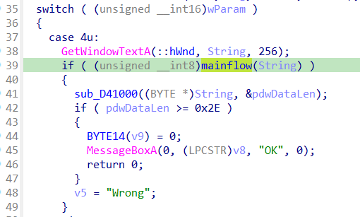

- Follow theo luồng của hàm này ta thấy có các case xử lý dữ liệu như sau:
  
  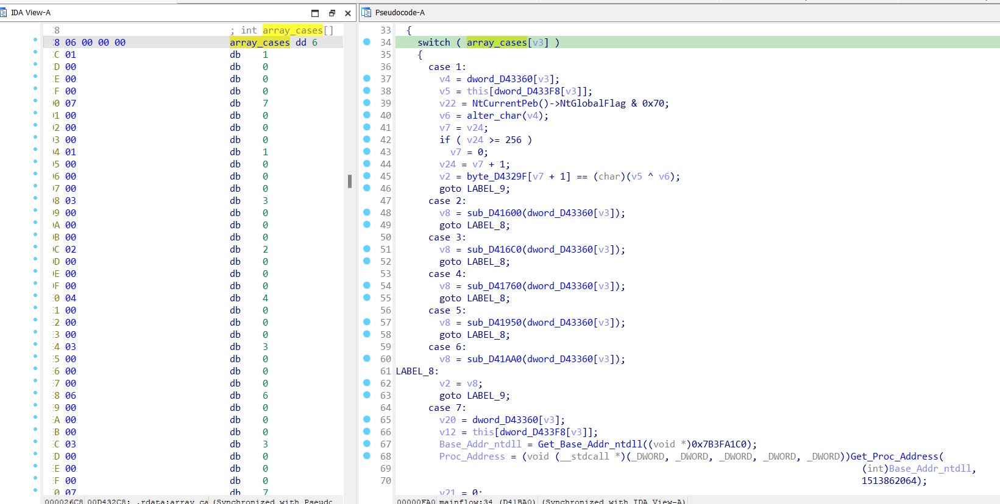

#### **[+]** `Case 1: NtGlobalFlag`
- Chương trình check có nằm trong môi trường debug hay không ? nếu có `NtGlobalFlag` được đặt giá trị là `0x70` và `dl = 1`.
- Hàm `alter_char()` được gọi và nếu phát hiện debug thì tham số thứ nhất là `dl = 1`.
- Giá trị của tham số thứ nhất khi chương trình không debugger là `0`.

  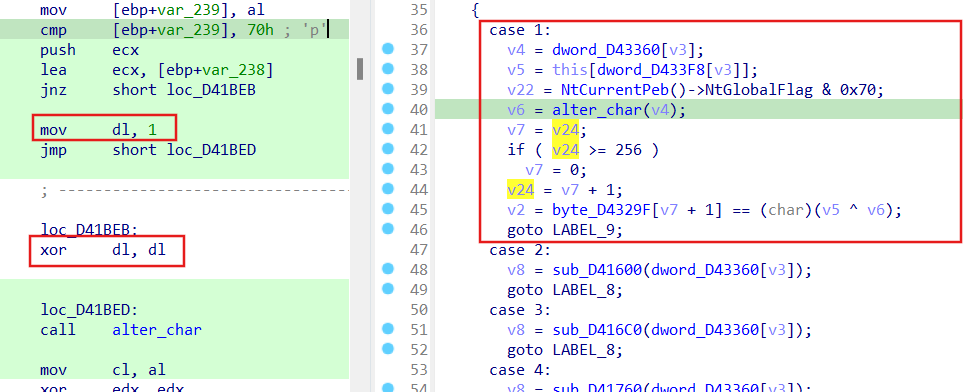

#### **[+]** `Case 2: HeapFlag | Flags`
- Chương trình kiểm tra debugger bằng field `Flags` có offset `0xC` so với heapbase.
- Nếu phát hiện debug, hay `v11 = 0x40000062` => tham số thứ nhất có giá trị là 0.
- Giá trị của tham số thứ nhất khi chương trình không debugger là 1.

  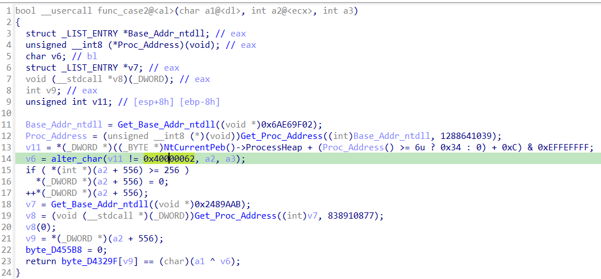

#### **[+]** `Case 3: HeapFlag | ForceFlags`
- Chương trình kiểm tra debugger bằng field `Force Flags` có offset `0x10` so với heapbase.
- Nếu phát hiện debug hay `v6 = 0x40000060`, tham số thứ nhất có giá trị là 0.
- Giá trị của tham số thứ nhất khi chương trình không debugger là 1.

  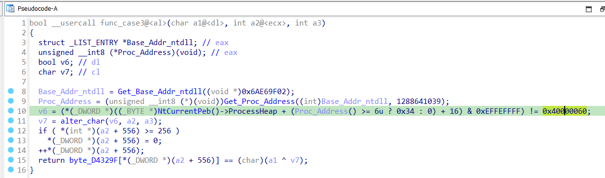

#### **[+]** `Case 4: Heap Protection`
- Kiểm tra debug bằng cách kiểm tra nếu cờ HEAP_TAIL_CHECKING_ENABLED được đặt thì sẽ thêm 2 chuỗi 0xABABABAB (tổng cộng 8 AB) vào cuối heap được phân bổ .
- Nếu phát hiện debug thì check = 1 => tham số thứ nhất có giá trị là 1.
- Giá trị của tham số thứ nhất khi chương trình không debugger là 0.

  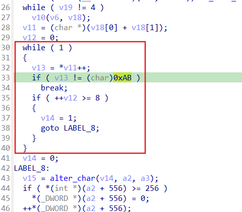
#### **[+]** `Case 5: CreateToolhelp32Snapshot`
- Lấy id tiến trình gốc và tên tiến trình gốc và kiểm tra nếu debug thì giá trị tham số thứ nhất là 1.
- Giá trị của tham số thứ nhất khi chương trình không debugger là 0.
  
  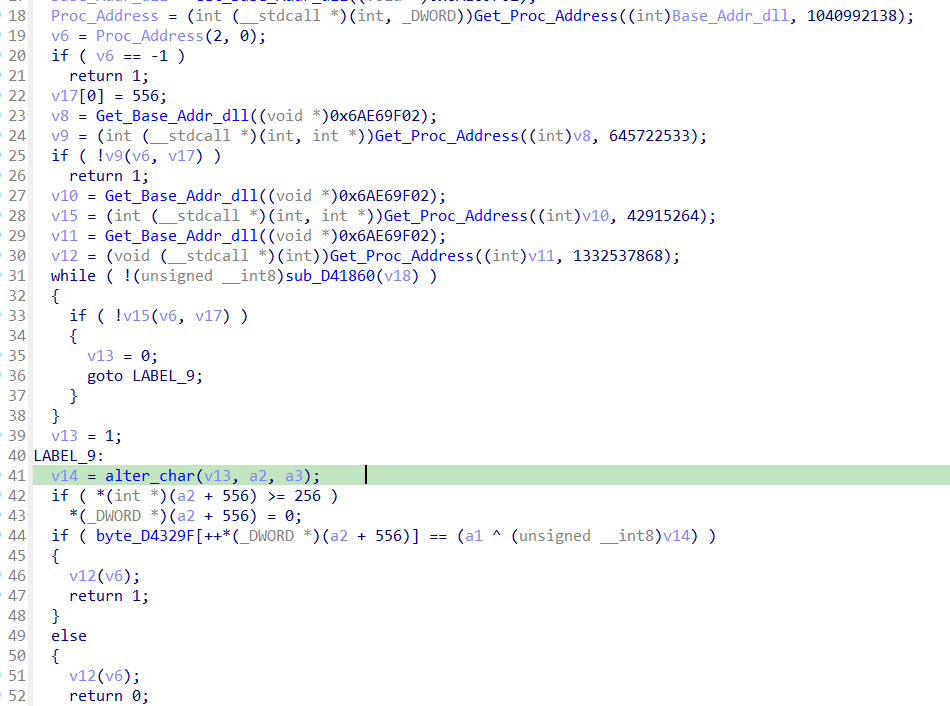

#### **[+]** `Case 6: BlockInput`
- Gọi `BlockInput()` 2 lần với tham số đầu vào đều là 1 (true). `v7` sẽ trả về true (mặc định) còn `v8` nếu có debug thì sẽ trả về `true` (bình thường sẽ trả về `false`) => ngăn chặn debug bằng cách thực hiện `BlockInput()` 2 lần.
- Ở đây `byte_D455B8 = 0` nên ko thực hiện dòng 13->17 -> Vì vậy nếu có debug thì `v7 == v8` hay tham số đầu thứ nhất có giá trị là `0`.
- Giá trị của tham số thứ nhất khi chương trình không debugger là `1`.

  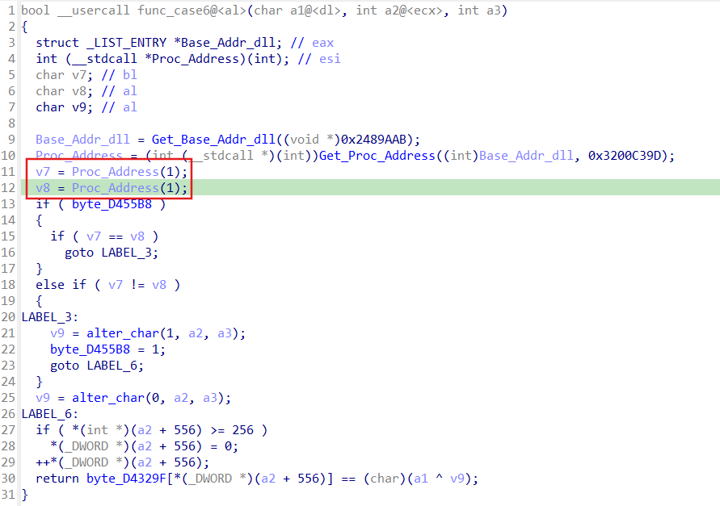
#### **[+]** `Case 7: NtQueryInformationProcess | ProcessDebugFlags`
- Với trường `ProcessInformation` = `0x1F` 1 cấu trúc `EPROCESS` được gọi đến. Trong cấu trúc này có trường `NoDebugInherit`. Giá trị của trường này được trả về tại `ProcessInformation` nếu giá trị trả về tại đây khác `0` báo hiệu chương trình đang chạy dưới debugger.
- Chương trình sẽ đặt giá trị tham số thứ nhất = `0` nếu như đang debug.
- Giá trị của tham số thứ nhất khi chương trình không debugger là `1`.

  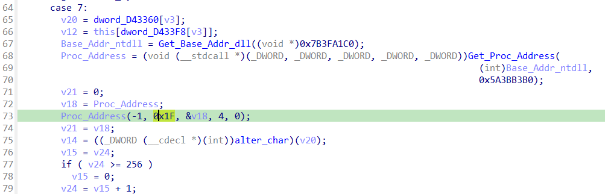

### **[+]** Kết luận:
Sau tất cả các case chúng ta thấy rằng chương trình sẽ đều gọi hàm `alter_char()` và trả về giá trị để xor với `cipher` nhằm sinh key. Hàm alter_char() nhận đầu vào là ba tham số:
- `checkDebugger`: giá trị này là `0` hoặc `1` tùy từng case.
- `data`: giá trị của mảng này được khởi tạo ở đầu hàm checkDebugging, ta có thể lấy giá trị này khi debug.
  
  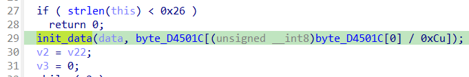

- Thứ ba là biến `dword_D43360`.

## **[3] Solve**
- Lấy nguyên hàm `alter_char()` của chương trình và code lại các switch case tương ứng nhằm xử lý dữ liệu để lấy được key đúng.

    ```python
    def gen_const(a1: int, a2: bytearray, a3: int) -> int:
        v4 = a3 - 1
        v18 = 171
        v6 = 0

        while v18:
            # Part 1: update v7 and mutate a2
            if v4 <= 5:
                offset = 4 * v4 + 16
                if int.from_bytes(a2[offset:offset + 4], 'little') != 0:
                    v8 = int.from_bytes(a2[offset:offset + 2], 'little')
                else:
                    v8 = int.from_bytes(a2[4 * v4:4 * v4 + 2], 'little')
                v7 = (v8 >> 1) | (((32 * v8) ^ (v8 ^ (4 * (v8 ^ (2 * v8)))) & 0xFFE0) << 10)
                a2[offset:offset + 4] = (v7 & 0xFFFFFFFF).to_bytes(4, 'little')
            else:
                v7 = 0

            v9 = v7 & 0x7FF
            v10 = v7 & 7
            v11 = v9 >> 3

            if a1:
                v12 = a2[v11 + 44]
            else:
                v12 = (~a2[v11 + 44]) & 0xFF

            a2[v11 + 44] = v12 ^ (1 << v10)

            v18 -= 1

        # Part 2: checksum across bytes
        v6 = 0
        for i in range(64):
            base = 46 + 4 * i
            v16 = a2[base - 2]
            v6 ^= a2[base] ^ a2[base + 1] ^ a2[base - 1] ^ v16
        return v6 & 0xFF


    index_table = [9, 18, 15, 3, 4, 23, 6, 7, 8, 22, 10, 11, 33, 13, 14, 27, 16, 37, 17, 19, 20, 21, 5, 34, 24, 25, 26, 2, 12, 29, 30, 31, 32, 28, 0, 35, 36, 1]
    g_const = [1, 3, 1, 1, 2, 1, 3, 1, 2, 2, 4, 4, 1, 3, 4, 4, 4, 1, 2, 1, 4, 1, 4, 3, 1, 2, 4, 4, 2, 2, 1, 3, 4, 2, 1, 2, 2, 3]
    cipher = [14, 235, 243, 246, 209, 107, 167, 143, 61, 145, 133, 43, 134, 167, 107, 219, 123, 110, 137, 137, 24, 149, 103, 202, 95, 226, 84, 14, 211, 62, 32, 90, 126, 212, 184, 16, 194, 183]
    program = [6, 1, 7, 1, 3, 2, 4, 3, 6, 3, 7, 6, 1, 4, 7, 4, 1, 5, 7, 6, 7, 5, 6, 4, 5, 1, 7, 5, 2, 3, 1, 2, 3, 2, 1, 6, 2, 4]

    # Build default_const accurately (length 302+ maybe)
    default_const_list = [0]*400
    default_const_list[0:16] = [54,236,0,0,54,237,0,0,54,187,0,0,54,140,0,0]
    default_const_list[32] = 95
    default_const = bytearray(default_const_list)

    key = bytearray(40)

    for i in range(38):
        g = g_const[i]
        p = program[i]
        if p in (1, 4, 5):
            tmp = gen_const(0, default_const, g)
        elif p in (2, 3, 6, 7):
            tmp = gen_const(1, default_const, g)
        else:
            continue
        key[index_table[i]] = cipher[i] ^ tmp

    print(key.decode('latin1', errors='replace'))

    # I_10v3-y0U__wh3n Y0u=c411..M3 Senor1t4
    ```

- Run chương trình ta lấy được key `I_10v3-y0U__wh3n Y0u=c411..M3 Senor1t4`, nhập key lấy được flag `vcstraining{Th3_U1tiM4t3_ant1_D3Bu9_ref3r3ncE}`.
  
  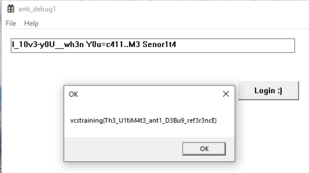