# WriteUp antidebug_3
## **[1] Phân tích**
### **1.1. TỔNG QUAN**
- Kỹ thuật anti-debug được sử dụng:
  - `RaiseException()`
  - `PEB!BeingDebugged` Flag
- Kỹ thuật khác:
  - Chèn mã shellcode
  - Anti-disassembly
### **1.2. CHI TIẾT**
- Khi mới tải chương trình vào IDA thì graph sẽ trông như thế này:
  
  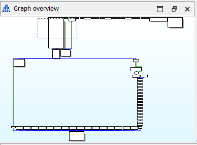

- Trông khá bình thường vì các khối mã asm đều có các đường nối tới nhau. Ví dụ, khi focus vào khối có chứa các string phổ biến như "Wrong Flag",... để trace các luồng chương trình trước đó thì chỉ thấy có duy nhất 1 khối trỏ tới nó nên không thể phân tích tĩnh được.
  
  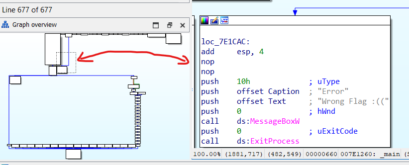

  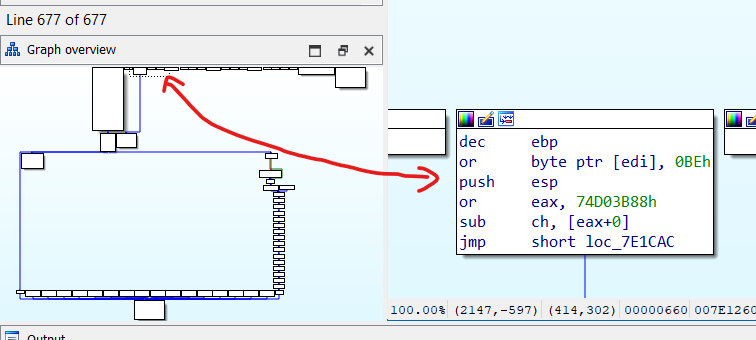

- Khi tạo mã giả C, ta có thể thấy mọi thứ trông rất bình thường

  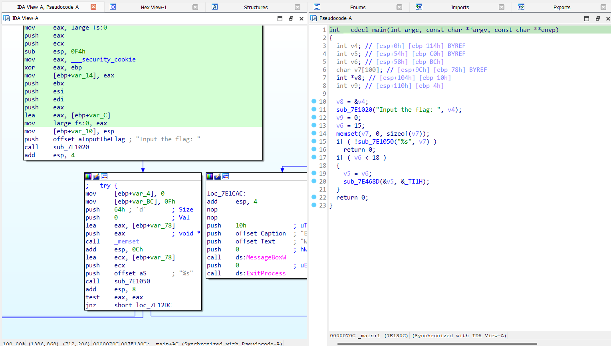

- Tuy nhiên, có một số đoạn ida không thể tạo mã giả nên buộc phải phân tích bằng cách đọc mã assembly.
- Tôi đã đặt breakpoint ở ngay sau lệnh `scanf()` để theo dõi luồng thực thi của chương trình.
- Như trong mã giả ở dòng 16, 17, ta có thể thấy luồng thực thi chỉ có 2 hướng, `scanf()` có thực hiện đúng cách hoặc là không.
  - Nếu hàm `scanf()` bị lỗi thì chương trình sẽ exit ngay lập tức
  - Ngược lại, nó sẽ gọi 1 hàm trong khối rẽ nhánh `if(v6 < 18)`, hàm này thực chất là đang raise 1 exception tương tự với thông báo **debugger detected**.

    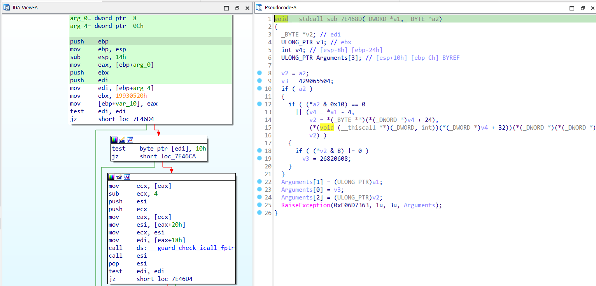

- Đó là 2 luồng thực thi cơ bản của khối rẽ nhánh `if scanf()`. Tuy nhiên, nó còn trỏ tới một luồng khác như sau

  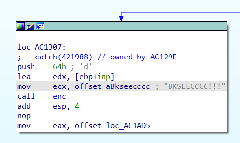

- String `"BKSEECCCC!!!"` có vẻ là 1 key, bởi hàm được call ngay sau đó (hàm `enc`) được truyền vào 3 tham số, trong đó có input và 1 số nguyên gì đó. Sau quá trình phân tích và dự đoán thì có thể nghi ngờ đây là hàm mã hoá, nên tôi đã đổi lại tên của hàm và các tham số truyền vào như sau:

  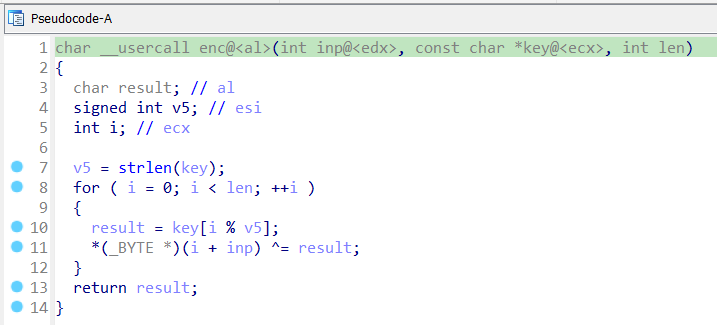

- Đây là một hàm mã hoá xor cơ bản và code khá clear nên tôi sẽ không phân tích kỹ hơn cách nó mã hoá.
- Sau khi call xong hàm mã hoá đó, nó gán 1 chuỗi data gì đó vào thanh ghi eax. Chuỗi data này chính là các byte shellcode chỉ có thể được gán và thực thi trong quá trình chạy chương trình.
- Tiếp theo ta tiến hành debug để theo dõi chính xác luồng thực thi của chương trình.

  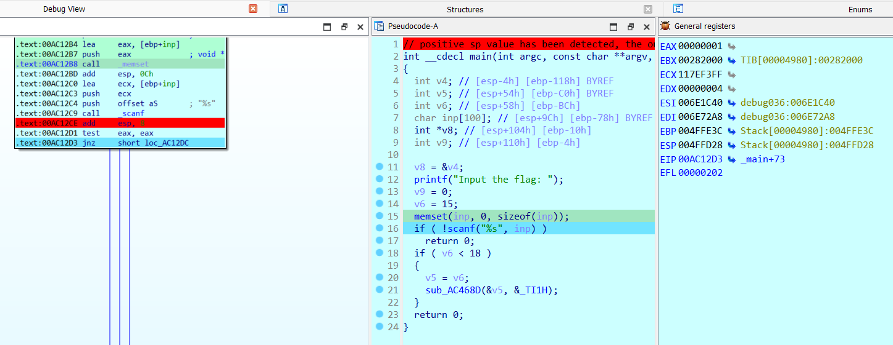

- `scanf()` trả về giá trị 1 nên chắc chắn chương trình sẽ raise exception. Việc chúng ta cần làm bây giờ là sửa giá trị thanh ghi EIP để nó jump thẳng tới luồng gọi hàm `enc()`

  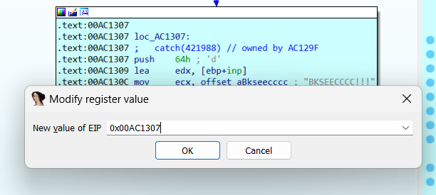

- Sau khi thực hiện xong khối code đó, các shellcode được gán vào thanh ghi `eax` trước đó sẽ được chuyển thành mã máy và được thực thi ngay sau đó. Lúc này ta có thể thấy graph đã thay đổi khá nhiều so với graph trước đó. Điều đó có nghĩa là luồng chương trình đã có sự thay đổi đáng kể.
  
  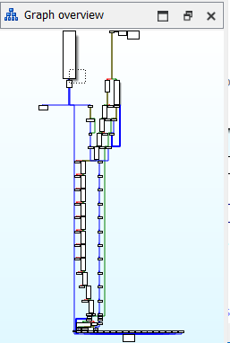

- Các đoạn code bắt đầu từ đây trở đi IDA không thể tạo mã giả được nên cần phải đọc mã assembly để phân tích tiếp.
- Phần tiếp theo sẽ được chia thành **2 hướng thực thi**. Điều kiện ở đây là debugger có bị detect hay không, kỹ thuật được sử dụng đơn giản là kiểm tra DebugFlag có được bật hay không.

  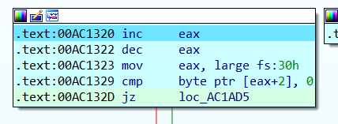

- Phần luồng thực thi khi detect debugger sẽ được phân tích kỹ hơn ở phần **[3] Tìm hiểu thêm**.
- Nếu không bị debug, nó đơn giản sẽ thực hiện shellcode được gán địa chỉ vào thanh ghi `eax` được mô tả trước đó. Đoạn shellcode này không có kỹ thuật gì cao siêu, nó chỉ đơn thuần gán các byte `ciphertext` của `flag` vào các biến được khai báo sẵn.
  
  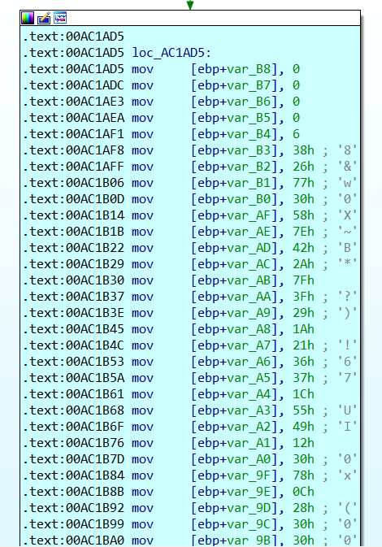

- Sau đó nó sẽ sử dụng vòng for để ghi đè các byte `ciphertext` này vào mảng `byte_AE18B0` đã có dữ liệu sẵn:
  
  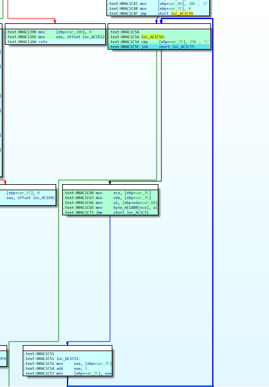

- Cuối cùng nó sẽ được đưa vào 1 vòng for nữa để kiểm tra lần lượt từng ký tự `input` được mã hoá xem có khớp với các byte được khởi tạo ở hình trên hay không rồi in ra xác nhận flag đúng
  
  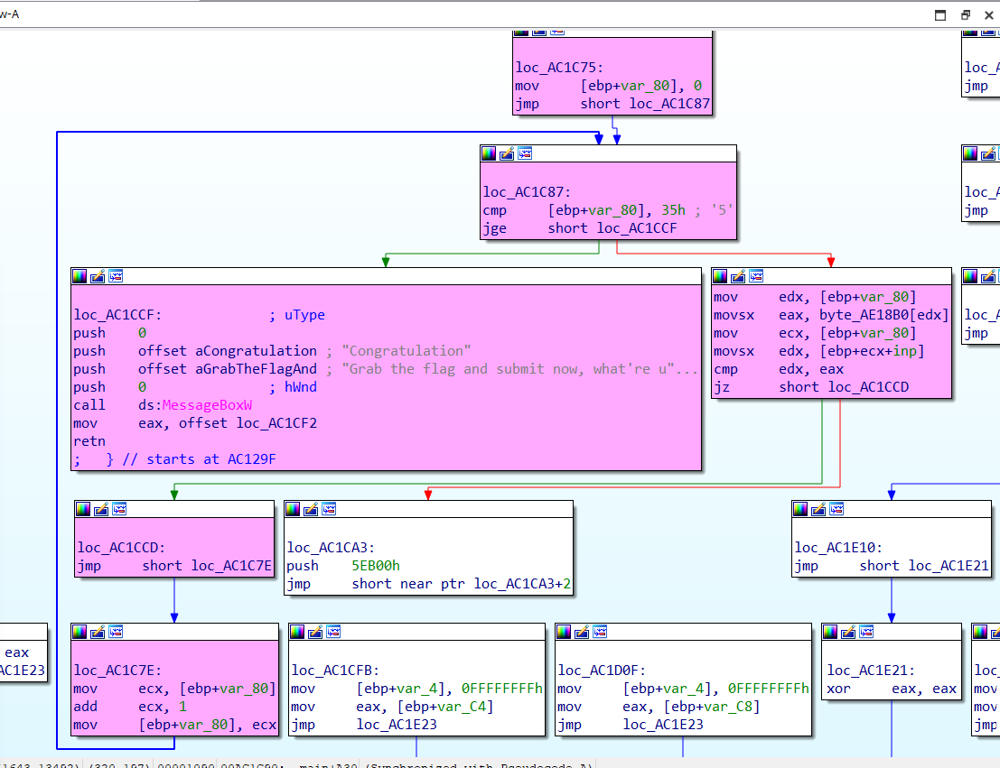

## **[2] Solve**
- Vì mã hoá sử dụng xor đơn giản nên ta cũng chỉ cần lấy `key` và `ciphertext` xor ngược lại là sẽ ra flag
- Code:
  ```
  def dec(cipher, key):
      i = 0
      plain = ''
      for x in cipher:
          p = chr(x ^ ord(key[i%len(key)]))
          plain += p
          i += 1
      return plain
  
  cipher = [
    0, 0, 0, 0, 6, 56, 38, 119, 48, 88, 126, 66, 42, 127, 63, 41, 26, 33, 54, 55, 28, 85, 73, 18, 48, 120, 12, 40, 48, 48, 55, 28, 33, 18, 126, 82, 45, 38, 96, 26, 36, 45, 55, 114, 28, 69, 68, 67, 55, 44, 108, 122, 56
  ]
  key = 'BKSEECCCC!!!'
  
  plaintext = dec(cipher, key)
  print(plaintext)
  
  # BKSEC{0n3_0f_th3_e4si3st_chall_hop3_y0u_enj0y_1t_!^^}
  ```
> **Flag:** `BKSEC{e4sy_ch4ll_but_th3r3_must_b3_som3_ant1_debug??}`
## **[3] Tìm hiểu thêm**
- Ở phần này tôi chỉ phân tích kỹ hơn về luồng đánh lừa khi bị detect debugger.
- Sau khi pass qua hàm detect debugger với DebugFlag, chúng ta sẽ cần để ý vào các khối ở graph như sau:
  
  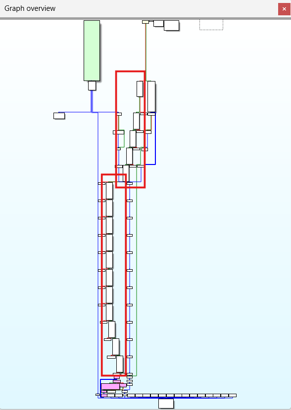

- Cụ thể mỗi khối sẽ thực hiện đoạn lệnh:
  
  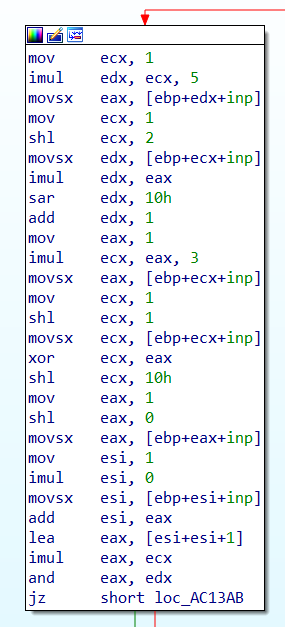

- Lấy ví dụ ở hình trên, ta có thể mô tả cách hoạt động của mỗi khối như sau:
  - Lấy 6 byte liền kề của input
  - Thực hiện biểu thức `expr = ((inp[8]^inp[9]) << 16) * (2*(inp[6]+inp[7])+1)` và sau đó `expr &= ((inp[10] * inp[11]) >> 16) + 1`
  - Nếu kết quả bằng 0 thì chương trình sẽ **exit**
  - Nếu khác 0 sẽ lần lượt chạy qua các khối đó cho đến hết, sau đó, **ciphertext giả** được đem ra kiểm tra. **ciphertext giả** này chính là mảng `byte_AE18B0` được khởi tạo sẵn giá trị từ trước.
  
    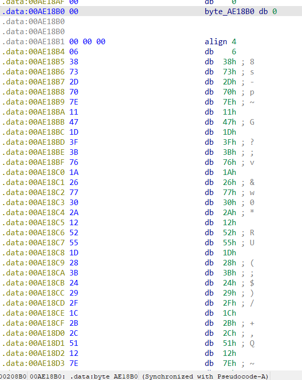

  - Nếu đem các byte này xor với `key` thì sẽ ra **fake flag**:<br>
  `BKSEC{0n3_0f_th3_e4si3st_chall_hop3_y0u_enj0y_1t_!^^}`