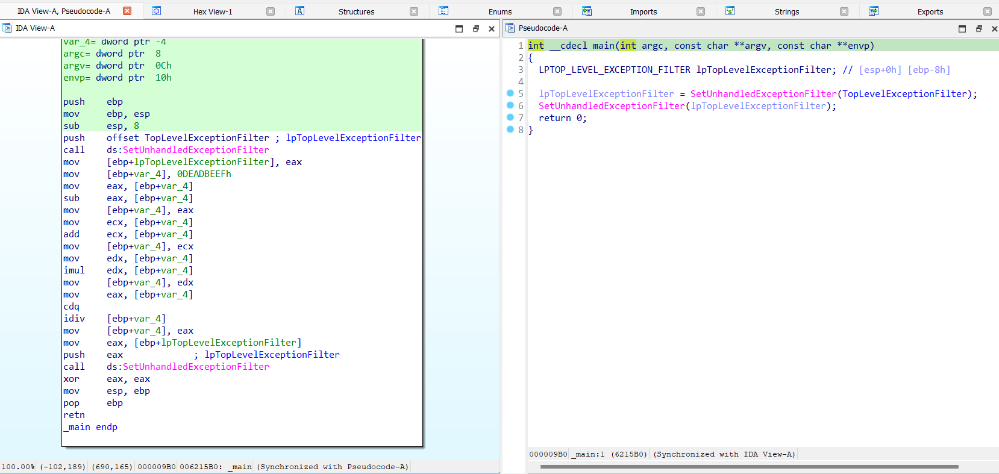
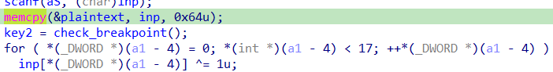
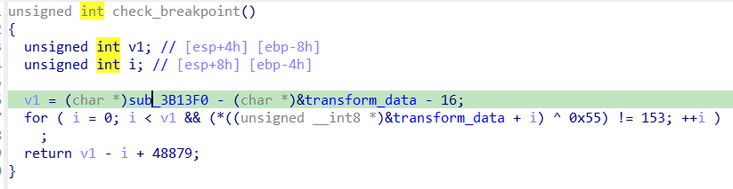

# WriteUp antidebug_3
## **[1] PHÂN TÍCH**
- Khi mới tải chương trình vào IDA, hàm `main()` được hiển thị đầu tiên và cũng là entry point duy nhất, trong hàm này có kỹ thuật antidebug sử dụng `UnhandledExceptionFilter()`.
  
  

- Nếu không bị debug, nó sẽ gọi hàm `TopLevelExceptionFilter`
  
  

- Ở hàm này, có thế thấy dấu hiệu rất rõ ràng của kỹ thuật antidebug sử dụng trường `NtGlobalFlag` trong `PEB` (đường đóng khung màu đỏ)
  - Nếu không bị debug, nó sẽ gán vào biến local giá trị 0 (đường đóng khung màu vàng). Ngược lại sẽ gán biến đó giá trị 1
  - Gán xong, nó xor với giá trị `0xCD`
  - Điều đó có nghĩa là giá trị chính xác của biến cần lấy ở đây là `0xCD`.

- Tiếp theo, để có thể focus vào các hàm quan trọng, ta có thể tìm trong bảng strings các từ khoá phổ biến ví dụ như "flag", "Wrong", "True",... Trong trường hợp này tôi phát hiện có 2 strings liên quan như sau:
  
  

- Sau đó xref tới hàm có chứa đoạn này sẽ thấy yêu cầu nhập input, input này có vẻ là chỉ có 18 bytes thôi, tuy nhiên, các bytes phía sau nó sẽ được sử dụng trong phần chương trình sau đó nên input thực tế cần nhập vào sẽ có độ dài 100 bytes (chi tiết sẽ được đề cập ở phần sau).

  

  
  
- Ở phần trước, chúng ta đã biết được giá trị `[ebp-0Ch]` khi không bị debug là `0` nên ở chỗ này byte `byte_3B4083` được gán giá trị `0 xor 0CDh` tức là `byte_3B4083 = 0xCD`
- `byte_3B4082` cũng được gán giá trị `PEB!BeingDebugged xor 0xAB` tức là `byte_3B4082` có giá trị là `0xAB` nếu không bị debug.
- Tiếp theo, chúng ta sẽ lần lượt đi qua các case mã hoá.

### **1.1 `enc1()`**
- Trước tiên, hàm này gán input vừa nhập vào 1 vùng nhớ khác mà tôi đã đổi tên thành `plaintext`, và biến toàn cục này được khai báo ngay trước biến `inp` và có vừa đúng 100 bytes.

  

- Tiếp theo nó kiểm tra breakpoint 1 cách đơn giản là tìm byte `0xCC` tượng trưng cho opcode `int 3`

  

- Sau khi nó kiểm tra breakpoint xong nó sẽ lưu vào biến `key2`, biến này rất quan trọng vì nó sẽ được sử dụng để mã hoá ở hàm `enc2()`
  - Nếu không bị debug thì hàm `check_breakpoint()` sẽ trả về cho `key2` giá trị `48879`, tương ứng với `0xBEEF`.
- Gán xong giá trị cho `key2`, lúc này **17 bytes đầu** của `input` được xor với `1`

### **1.2 `enc2()`**
- Tới hàm `enc2()`, nó truyền tham số là địa chỉ của biến `inp_18`, chính là các byte bị tràn từ `input` mà tôi đã đề cập ở phía trên

  

- Hàm này có gọi tới 1 hàm khác tên là `transform_data` và đối số được truyền vào chính là các byte `inp_18` vừa rồi

  

  - Ảnh trên là phần đầu của hàm `transform_data` này, có lẽ phần gây lỗi chính là ở nhãn `loc_3B133A` khi mà nó jump tới byte `EB` thay vì jump tới opcode của lệnh `mov` hay 1 vùng nhớ có ý nghĩa nào khác; đồng thời lệnh `call` cũng đang gọi 1 hàm không xác định nào đó khiến cho đoạn code này không thể tạo function được. Tiến hành nop đoạn mã từ nhãn `loc_3B133A` đến hết lệnh `call` để IDA có thể tạo mã giả dễ hình dung hơn

    

  - Hàm mã hoá này được chia thành 2 phần, 1 là 8 byte đầu và 1 là 12 byte sau
  - Ở phần thứ nhất, đây là 1 vòng lặp, lặp qua 8 byte đầu, mỗi lần lặp sẽ thực hiện xor từng byte với giá trị `byte_3B4082` đã được thay thế ở ngay trước khi có yêu cầu nhập input

    

  - Sau đó, nó tăng giá trị con trỏ lên 9 (bỏ qua byte ở index 8) sau đó nó thực hiện:
    - Chèn bit 1 vào cuối mỗi byte
    - Xor với giá trị `byte_3B4083 + i`
  
    

- Cần để ý rằng, khi gọi hàm `transform_data`, địa chỉ của dữ liệu đã được thay đổi 2 lần (cộng với 9 để xử lý tiếp dữ liệu và trước khi thoát hàm lại cộng với 13)
- Sau khi đã mã hoá xong với hàm `transform_data`, nó tiếp tục được thông qua vòng lặp để xor lần lượt mỗi 2 byte liên tiếp với `key2` trước đó.
  
  

- Sau đó tiếp tục đi vào hàm `enc3()`

### **1.3 `enc3()`**
  

  - Hàm này sử dụng 2 kỹ thuật gây exception liên tiếp bằng `int 2D` và `int 3`.
  - Với `int 2D`, nếu có debugger, nó sẽ chạy vòng for ngay phía dưới, tuy nhiên, luồng xử lý exception của ngắt `int 2D` chỉ có thể thấy được ở mã assembly

    

  - Luồng thực thi thực sự nếu không có debugger gắn vào là luồng sau:

    

    - Luồng này thực hiện xoay vòng phải 1 số lượng byte phụ thuộc vào index `i` của vòng lặp.
    - Ta có thể hiểu như sau:
      ```
      for ( i = 0; i < 5; ++i )
        *(_BYTE *)(i + a1) = (*(_BYTE *)(i + a1) << (8 - i)) | (*(char *)(i + a1) >> i);
      ```

  - Tiếp theo `int 3` cũng tương tự như `int 2D`, khi đọc assembly sẽ thấy giá trị tại vùng nhớ `a1+6` (tức là sau phần xử lý `int 2D` vừa rồi 1 byte) được xor với 1 giá trị khác khi **không có debugger**. Giá trị đó là `0xC0FE1337`.
    
    

### **1.4 `enc4()`**
- Hàm `enc4()` đơn giản chỉ xor từng byte với giá trị của byte trước đó, hàm này khá tường minh nên tôi sẽ không giải thích thêm.
  
  

### **End**
- Cuối cùng, khi đã hoàn thành toàn bộ 4 hàm mã hoá, input cuối cùng sẽ được kiểm tra với mảng các byte được khai báo sẵn.
  
  

- Nếu khớp, flag đúng sẽ được in ra.
## **[2] SOLVE**
- Cách solve của bài này là giải mã lần lượt từ các hàm mã hoá `enc4()` về `enc1()`, vì có 1 số dữ liệu có thể bị ghi đè
- Sau đây là code solve bằng python:
  
  ```
  byte_624082 = 0xAB
  byte_624083 = 0xCD
  key_xor_dword_624658 = [0xC0, 0xFE, 0x13, 0x37][::-1]
  key2 = [0xBE, 0xEF][::-1]
  
  data = [
      0x74, 0x6F, 0x69, 0x35, 0x4F, 0x65, 0x6D, 0x32, 0x32, 0x79, 
      0x42, 0x32, 0x71, 0x55, 0x68, 0x31, 0x6F, 0x5F, 0xDB, 0xCE, 
      0xC9, 0xEF, 0xCE, 0xC9, 0xFE, 0x92, 0x5F, 0x10, 0x27, 0xBC, 
      0x09, 0x0E, 0x17, 0xBA, 0x4D, 0x18, 0x0F, 0xBE, 0xAB, 0x5F, 
      0x9C, 0x8E, 0xA9, 0x89, 0x98, 0x8A, 0x9D, 0x8D, 0xD7, 0xCC, 
      0xDC, 0x8A, 0xA4, 0xCE, 0xDF, 0x8F, 0x81, 0x89, 0x5F, 0x69, 
      0x37, 0x1D, 0x46, 0x46, 0x5F, 0x5E, 0x7D, 0x8A, 0xF3, 0x5F, 
      0x59, 0x01, 0x57, 0x67, 0x06, 0x41, 0x78, 0x01, 0x65, 0x2D, 
      0x7B, 0x0E, 0x57, 0x03, 0x68, 0x5D, 0x07, 0x69, 0x23, 0x55, 
      0x37, 0x60, 0x14, 0x7E, 0x1D, 0x2F, 0x62, 0x5F, 0x62, 0x5F
  ]
  
  def dec4(arr, start):
      for i in range(30,1, -1):
          arr[i+start-1] ^= arr[i+start-2]
  
  def dec3(arr, start):
      for i in range(0, 5):
          arr[i+start] = ((arr[i+start] >> (8-i)) | (arr[i+start]   << (i))) & 0xFF
      arr[start+6] ^= key_xor_dword_624658[0]
      arr[start+7] ^= key_xor_dword_624658[1]
      arr[start+8] ^= key_xor_dword_624658[2]
      arr[start+9] ^= key_xor_dword_624658[3]
  
  def reverse_transform_data(arr, start):
      for i in range(start, start+8):
          arr[i] ^= byte_624082
      start += 9
      for i in range(0, 12):
          x = (byte_624083 + i) & 0xFF
          arr[i+start] ^= x
          arr[i+start] >>= 1
  
  def dec2(arr, start):
      reverse_transform_data(arr, start)
      start += 9+13
      for i in range(0, 9):
          arr[2*i + start] ^= key2[0]
          arr[2*i + start + 1] ^= key2[1]
  def dec1(arr, start):
      for i in range(start, start+17):
          arr[i] ^= 1
  
  dec4(data, 18+13+9+19+11)
  dec3(data, 18+13+9+19)
  dec2(data, 18)
  dec1(data, 0)
  inp = ''.join(chr(i) for i in data)
  print(inp)
  inp_hex = ' '.join(hex(i)[2:] for i in data)
  print(inp_hex)
  
  #   unh4Ndl33xC3pTi0n_pebDebU9_nt9lob4Lfl49_s0F7w4r38r34Kp01n7_int2d_i  nt3_YXV0aG9ydHVuYTk5ZnJvbWtjc2M===
  # 75 6e 68 34 4e 64 6c 33 33 78 43 33 70 54 69 30 6e 5f 70 65 62 44 65 62 55 39 5f 6e 74 39 6c 6f 62 34 4c 66 6c 34 39 5f 73 30 46 37 77 34 72 33 38 72 33 34 4b 70 30 31 6e 37 5f 69 6e 74 32 64 5f 69 6e 74 33 5f 59 58 56 30 61 47 39 79 64 48 56 75 59 54 6b 35 5a 6e 4a 76 62 57 74 6a 63 32 4d 3d 3d 3d
  ```
  > **Input:** `unh4Ndl33xC3pTi0n_pebDebU9_nt9lob4Lfl49_s0F7w4r38r34Kp01n7_int2d_int3_YXV0aG9ydHVuYTk5ZnJvbWtjc2M===`<br>
  > **Flag:** `kcsc{unh4Ndl33xC3pTi0n_pebDebU9_nt9lob4Lfl49_s0F7w4r38r34Kp01n7_int2d_int3_YXV0aG9ydHVuYTk5ZnJvbWtjc2M===}`

  