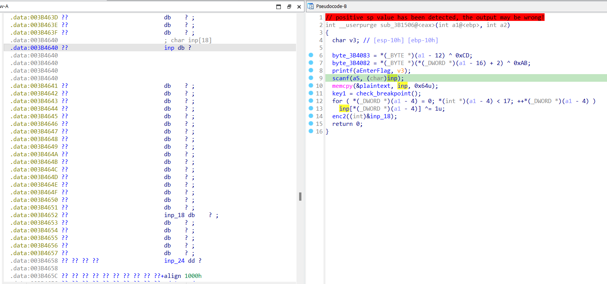

# WriteUp antidebug_3
## **[1] PHÂN TÍCH**
- Khi mới tải chương trình vào IDA, hàm `main()` được hiển thị đầu tiên và cũng là entry point duy nhất, tuy nhiên, trong hàm này chỉ có kỹ thuật antidebug sử dụng `UnhandledExceptionFilter()` mà không có luồng mong muốn nào được gọi tới.
  
  

- Để có thể focus vào các hàm quan trọng, ta có thể tìm trong bảng strings các từ khoá phổ biến ví dụ như "flag", "Wrong", "True",... Trong trường hợp này tôi phát hiện có 2 strings liên quan như sau:
  
  

- Sau đó xref tới hàm có chứa đoạn này sẽ thấy yêu cầu nhập input, input này có vẻ là chỉ có 18 bytes thôi, tuy nhiên, các bytes phía sau nó sẽ được sử dụng trong phần chương trình phía sau nên input thực tế cần nhập vào sẽ có độ dài 100 bytes (chi tiết sẽ được đề cập ở phần sau). Bên cạnh đó 1 byte `byte_624082` cũng được gán 1 giá trị khác và sẽ được sử dụng cho phần sau.

  

- Tiếp theo, chúng ta sẽ lần lượt đi qua các case mã hoá.

### **1.1 `enc1()`**
- Hàm này gán input vừa nhập vào 1 vùng nhớ khác mà tôi đã đổi tên thành `plaintext`.

  

- Tiếp theo nó kiểm tra breakpoint 1 cách đơn giản là tìm byte `0xCC` tượng trưng cho opcode `int 3`

  

- Sau khi nó kiểm tra breakpoint xong nó sẽ lưu vào biến `key2`, biến này rất quan trọng vì nó sẽ được sử dụng để mã hoá ở hàm `enc2()`
- Gán xong giá trị cho `key2`, lúc này 17 bytes đầu của `input` được xor với `1`

### **1.2 `enc2()`**
- Tới hàm `enc2()`, nó truyền tham số là địa chỉ của biến `unk_624652`, chính là các byte bị tràn từ `input` mà tôi đã đề cập ở phía trên

  

- Hàm này có gọi tới 1 hàm khác tên là `transform_data` và đối số được truyền vào chính là các byte `unk_624652` vừa rồi, tuy nhiên hàm này không thể tạo được mã giả C nên chỉ có thể đọc mã assembly để hiểu logic chương trình

  

  - Ảnh trên là phần đầu của hàm `transform_data` này, có lẽ phần gây lỗi chính là ở nhãn `loc_62133A` khi mà nó jump tới byte `EB` thay vì jump tới opcode của lệnh `mov` hay 1 vùng nhớ có ý nghĩa nào khác; đồng thời lệnh `call` cũng đang gọi 1 hàm không xác định nào đó khiến cho đoạn code này không thể tạo function được.
- Tới nhãn tiếp theo:
  
  

  - Đây là 1 vòng lặp, lặp qua 8 byte đầu, mỗi lần lặp sẽ thực hiện xor nó với giá trị `byte_624082` đã được thay thế ở ngay trước khi có yêu cầu nhập input

- Nhãn `loc_62137E`:
  
  

  - Nhãn này tăng giá trị con trỏ lên 9 sau khi đã thực hiện mã hoá 8 byte trước đó để tiếp tục mã hoá các byte sau

- Nhãn `loc_621394`:
  
  

  - Nhãn này tiếp tục là 1 vòng lặp 12 byte tiếp theo, lấy giá trị của byte `byte_624083` (có giá trị là 0xC) cộng với chỉ số hiện tại của vòng lặp rồi `and` với `0xFF` để giới hạn trong 1 byte
  - Tiếp theo nó lấy giá trị từng byte ở vị trí index rồi thực hiện phép dịch trái bit và or bit, sau đó xor với giá trị phía trên.
  - Có thể hiểu như sau:<br>
  `x = (byte_624083 + i) & 0xFF`<br>
  `buf[i] <<= 1`<br>
  `buf[i] |= 1`<br>
  `buf[i] ^= x`<br>
- Sau khi đã mã hoá xong với hàm `transform_data`, nó tiếp tục được thông qua vòng lặp để xor lần lượt mỗi 2 byte liên tiếp với `key2` trước đó. Sau đó tiếp tục đi vào hàm `enc3()`

### **1.3 `enc3()`**
  

  - Hàm này sử dụng 2 kỹ thuật gây exception liên tiếp bằng `int 2D` và `int 3`.
  - Với `int 2D`, nếu không có debugger, nó sẽ chạy vòng for ngay phía dưới, thực hiện xoay vòng bit (rotate) của từng byte trong 5 byte, mỗi byte sẽ được xoay vòng `i` bit.
  - Tiếp theo `int 3` đánh lừa ở mã giả C, khi đọc assembly sẽ thấy biến `dword_624658` được xor với 1 giá trị khác khi **không có debugger**. Giá trị đó là `0xC0FE1337`.
    
    

### **1.4 `enc4()`**
- Hàm `enc4()` đơn giản chỉ xor từng byte với giá trị của byte trước đó, hàm này khá tường minh nên tôi sẽ không giải thích thêm.
  
  

### **End**
- Cuối cùng, khi đã hoàn thành toàn bộ 4 hàm mã hoá, input cuối cùng sẽ được kiểm tra với mảng các byte được khai báo sẵn.
  
  

- Nếu khớp, flag đúng sẽ được in ra.
## **[2] SOLVE**
- Cách solve của bài này là giải mã lần lượt từ các hàm mã hoá `enc4()` về `enc1()`, vì có 1 số dữ liệu có thể bị ghi đè
- Sau đây là code solve bằng python:
  
  ```
  byte_624082 = 0x15
  byte_624083 = 0xC
  key_xor_dword_624658 = [0xC0, 0xFE, 0x13, 0x37]
  key2 = [0xBE, 0xEF]
  
  data = [
      0x74, 0x6F, 0x69, 0x35, 0x4F, 0x65, 0x6D, 0x32, 0x32, 0x79, 
      0x42, 0x32, 0x71, 0x55, 0x68, 0x31, 0x6F, 0x5F, 0xDB, 0xCE, 
      0xC9, 0xEF, 0xCE, 0xC9, 0xFE, 0x92, 0x5F, 0x10, 0x27, 0xBC, 
      0x09, 0x0E, 0x17, 0xBA, 0x4D, 0x18, 0x0F, 0xBE, 0xAB, 0x5F, 
      0x9C, 0x8E, 0xA9, 0x89, 0x98, 0x8A, 0x9D, 0x8D, 0xD7, 0xCC, 
      0xDC, 0x8A, 0xA4, 0xCE, 0xDF, 0x8F, 0x81, 0x89, 0x5F, 0x69, 
      0x37, 0x1D, 0x46, 0x46, 0x5F, 0x5E, 0x7D, 0x8A, 0xF3, 0x5F, 
      0x59, 0x01, 0x57, 0x67, 0x06, 0x41, 0x78, 0x01, 0x65, 0x2D, 
      0x7B, 0x0E, 0x57, 0x03, 0x68, 0x5D, 0x07, 0x69, 0x23, 0x55, 
      0x37, 0x60, 0x14, 0x7E, 0x1D, 0x2F, 0x62, 0x5F, 0x62, 0x5F
  ]
  
  def dec4(arr, start):
      for i in range(30,1, -1):
          arr[i+start] ^= arr[i+start-1]
  
  def dec3(arr, start):
      arr[start] = ((arr[start] << 1) | (arr[start] >> 7)) & 0xFF
      for i in range(1, 5):
          arr[i+start] = ((arr[i+start] >> (8-i+1)) | (arr[i+start]   << (i-1))) & 0xFF
      arr[0x18] ^= key_xor_dword_624658[0]
      arr[0x19] ^= key_xor_dword_624658[1]
      arr[0x1a] ^= key_xor_dword_624658[2]
      arr[0x1b] ^= key_xor_dword_624658[3]
  
  def reverse_transform_data(arr, start):
      for i in range(start, start+8):
          arr[i] ^= byte_624082
      start += 9
      for i in range(0, 12):
          x = (byte_624083 + i) & 0xFF
          arr[i+start] ^= x
          arr[i+start] >>= 1
  
  def dec2(arr, start):
      for i in range(0, 9):
          arr[2*i + start] ^= key2[0]
          arr[2*i + start + 1] ^= key2[0]  # Đúng ra phải là key2  [1], nhưng để key2[0] thì status cao hơn
      reverse_transform_data(arr, start)
  
  def dec1(arr, start):
      for i in range(start, start+17):
          arr[i] ^= 1
  
  dec4(data, 18+19+11)
  dec3(data, 18+19)
  dec2(data, 18)
  dec1(data, 0)
  inp = ''.join(chr(i) for i in data)
  print(inp)
  inp_hex = ''.join(hex(i)[2:] for i in data)
  print(inp_hex)
  
  # unh4Ndl33xC3pTi0n_pebDebÇòJJ♠\P\
  # 5^¾rt©×Ì►V.j◄Ö6^*[↓☺#÷y¬♠XV0aG9yd-{W♥h]i#U7`¶~↔/b_b_
  # 756e68344e646c3333784333705469306e5f70656244656295c7f25f58154e4d42146e441f264cbe7274a989988a9d8dd7cc10562e6a1150e8d6365e2a5b019123f779ac658563061473979642d7be573685d76923553760147e1d2f625f625f
  ```