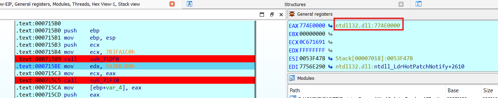
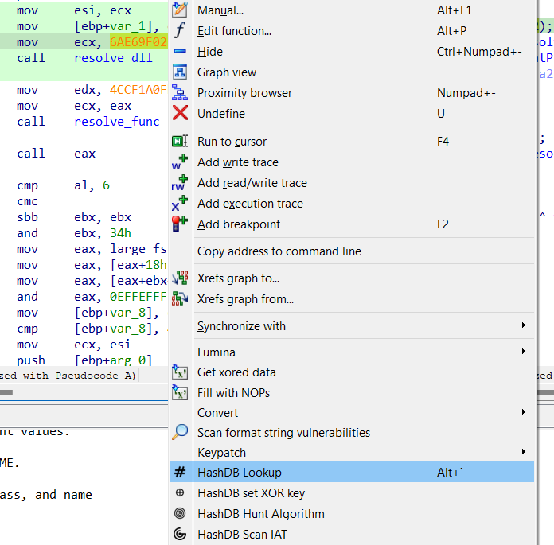
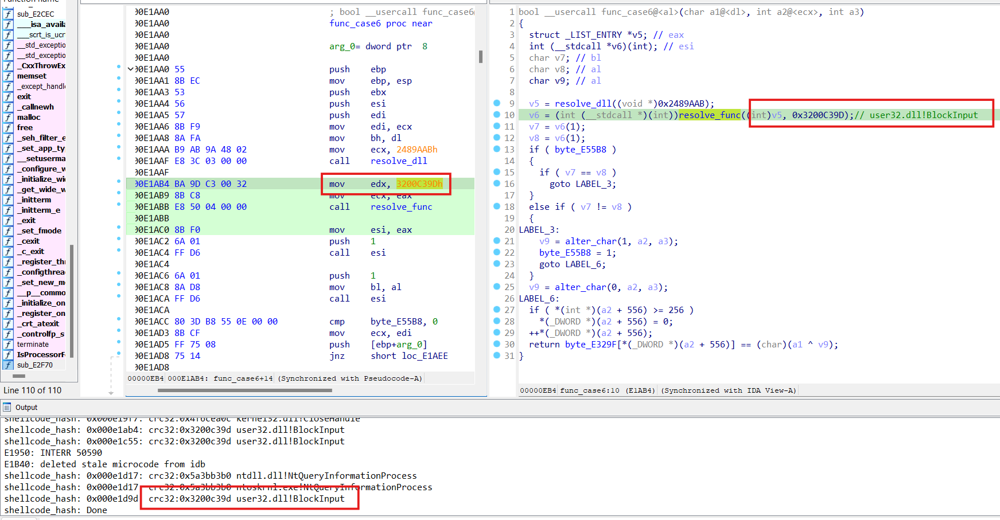
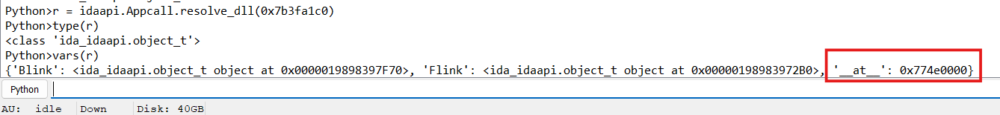
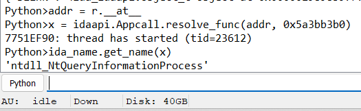
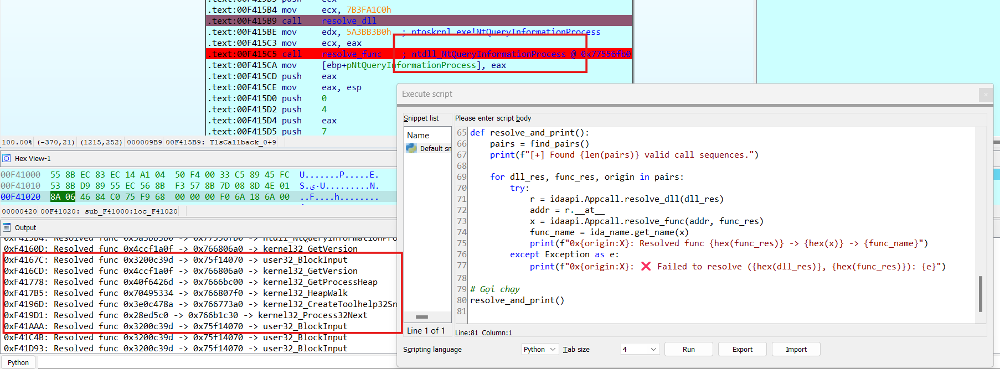

# AUTO RESOLVE API

## [1] Đặt vấn đề

- Trong bài reverse [anti3](anti3), có 1 số đoạn có mã hex như sau:
    

### **1.1 Mã hash**
- Khi debug, đặt breakpoint tại lệnh `call` và kiểm tra thanh ghi `eax` xem giá trị trả về thì ta có thể thấy 1 số string khá quen thuộc như sau:

    
    

- Thực tế các đoạn mã hex đó chính là mã hash crc32 của 1 số hàm WindowsAPI và tên của 1 số dll thường được sử dụng. Đây là 1 trong những kỹ thuật obfuscate điển hình của anti-debug.

### **1.2 Các hàm resolve địa chỉ**
- Hàm `sub_401DF0()` đổi tên thành hàm `resolve_dll()`
- Hàm `sub_401F10()` đổi tên thành hàm `resolve_func()`
    
**[+] Hàm resolve_dll()**
    
- Mục tiêu của hàm này là lấy địa chỉ của 1 dll cần tìm
- Nó duyệt toàn bộ dll được nạp vào chương trình rồi so sánh với mã hash truyền vào

**[+] Hàm resolve_func()**
    
- Mục tiêu của hàm này là lấy địa chỉ của 1 hàm nằm trong file dll vừa lấy từ hàm `resolve_dll()`
- Nó duyệt toàn bộ các hàm nằm trong bảng export directory của file dll trên rồi so sánh với mã hash truyền vào

## [2] Hướng giải quyết:
### **2.1 hashdb**
- Để giải quyết bài toán liên quan đến mã hash như trên, ta có thể sử dụng cách đơn giản là tìm kiếm mã hash tương ứng đã được lưu trong CSDL rồi ánh xạ nó với tên dll hay tên hàm tương ứng.
- Một CSDL hỗ trợ cách làm trên chính là [hashdb](https://github.com/OALabs/hashdb).
- Trong IDA, có thể cài đặt 1 plugin có các tính năng dự đoán mã hash và hỗ trợ **query trực tiếp** các mã hash trên CSDL, đó là [hashdb-ida](https://github.com/OALabs/hashdb-ida). Chi tiết cách cài đặt đều có trong link đính kèm.
- Trong 1 chương trình có thể có rất nhiều mã hash, việc thực hiện kiểm tra thủ công từng mã hash sẽ rất mất thời gian, vì thế chúng ta có thể sử dụng một plugin khác hỗ trợ giải quyết vấn đề này bằng cách **query hàng loạt**, đó là [Shellcode Hashes](https://github.com/mandiant/flare-ida/tree/master). Chi tiết cách cài đặt có trong link đính kèm.

### **2.2 Thực hành trên file anti3.exe**
**[+] Thực hiện query trực tiếp**
- Ví dụ ở hàm xử lý case 2 (hàm `func_case2()`) của luồng chính có đoạn tương tự như sau:
    
    

- Đặt con trỏ chuột tại mã hash `6AE69F02h` --> chuột phải --> click chọn `HashDB Hunt Algorithm` để tìm kiếm loại hash khả quan

    
    

- Tương tự, để tìm kiếm bản plaintext của mã hash đó, ta chọn `HashDB Lookup`

    
    

**[+] Thực hiện query hàng loạt**
- Chọn `Edit` --> `Plugins` --> `Shellcode Hashes`, 1 bảng chọn database hiện ra, chọn database đi kèm trong hướng dẫn `Shellcode Hashes` được đề cập ở trên, đường dẫn của nó là `flare-ida\shellcode_hashes\sc_hashes.db`, chọn thuật toán hash `crc32`, bỏ tick `Use XOR seed` và để ý bảng Output khi nó thực hiện xong.

    
    
    

- Ví dụ kết quả sau khi đã sử dụng plugin trên có thể thấy ở những chỗ có mã hash đều hiện comment về hàm WindowsAPI tương ứng:

    

## [3] Vấn đề phát sinh
- Có thể thấy ở ảnh phía trên, chỉ có mỗi hàm `kernel32.dll!GetVersion()` được resolve, ngay tại dòng 19, hàm `resolve_func()` cũng được gọi 1 lần nữa nhưng không có API nào được resolve. Thậm chí khi sử dụng cách trực tiếp resolve thì cũng không tìm được plaintext tương ứng.

    

- Khi kiểm tra lại hàm `resolve_dll()` hoặc `resolve_func()`, thấy có 1 đoạn rẽ nhánh so sánh mã hash có sử dụng hàm `abs32(~v7)`.

    

- Mục đích của hàm này là lấy giá trị dương của kết quả phép toán not bit.
- Để xử lý vấn đề này, ta cần phải lấy giá trị not bit ngược lại rồi thực hiện cách query hash trực tiếp. Khi này kết quả hash sẽ có thể tìm được trong database.
- Cách làm là chuột phải tại mã hash đó --> click `-<giá trị hash tương ứng>` hoặc sử dụng phím tắt `shift` + `-` --> chuột phải tại mã hash đó --> click `HashDB Lookup` rồi chú ý bảng Output hiển thị tên hàm được query.

    

- Thay vì làm thủ công như trên, ta có thể thêm vào database các mã hash sử dụng số đối của các data tương ứng theo các bước sau:
    - Query tất cả các hàm liên quan ứng với thuật toán hash cần chọn (ở đây là thuật toán crc32).
    - Lấy số đối của mã hash vừa query rồi sau đó append lại data đó vào trong database. 
    --> Công thức tính số đối: `custom_hash = (-hash_val) % 0xFFFFFFFF + 1` trong đó `hash_val` là 1 thuộc tính giá trị mã hash có trong database. [Code append data](append_db.py)
    - Sử dụng shellcode như cách làm phía trên và import database vừa update.

    

## [4] Sử dụng Appcall và IDA python
- Ngoài cách resolve dll và các API bằng việc query CSDL, ta có thể dùng cách làm đã đề cập ở mục **1.1**, debug và nhấn phím F8 để chạy qua các hàm resolve và xem nó trả về tên API là gì, địa chỉ của tên hàm này được lưu tại thanh ghi `eax`
- Tuy nhiên, nếu debug thủ công sẽ mất rất nhiều thời gian, vì thế có thể dùng IDA python để tự động hoá quá trình tìm kiếm mã hash, sau đó call các hàm resolve và in ra giá trị trả về. Các bước thực hiện:
    - Call `resolve_dll()` với tham số là mã hash của dll tìm được trước mỗi lệnh call, hàm này trả về 1 đối tượng, trong đó có 1 thuộc tính `__at__` lưu địa chỉ trả về của kết quả, hay chính là giá trị tại thanh ghi `eax`

        
    
    - Hàm `resolve_func()` được gọi ngay sau đó với tham số thứ nhất là địa chỉ của dll vừa resolve được, tham số thứ 2 là mã hash, kết quả trả về của hàm này là địa chỉ của API, muốn lấy được tên hàm thì có thể sử dụng `ida_name.get_name()` và truyền vào địa chỉ của API.

        

- Code resolve: [resolve API - IDA python](appcall.py)
- Kết quả sau khi chạy:

    