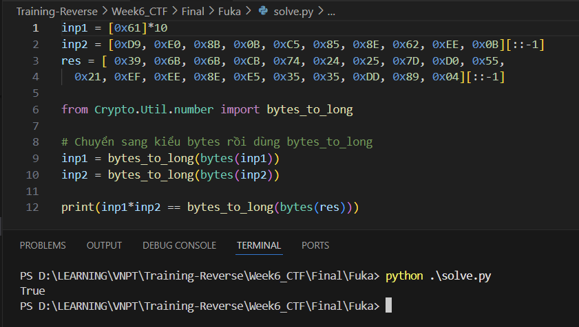

# Fuka

## [1] Mở đầu
- Khi mới load chương trình vào IDA và nhấn F5, có thể thấy chương trình không tạo mã giả tương ứng với mã assembly.

    

- Để tạo được full mã giả, ta có thể nhấn Ctrl+F5 hoặc tạo file C rồi lưu tại vị trí bất kỳ sau đó nhấn F5 một lần nữa để IDA load qua toàn bộ chương trình và tạo lại mã giả.

    

    

- Chương trình này được viết bằng C++ và tác giả code hướng đối tượng nên sẽ có một số phần khá khó hình dung.

## [2] Phân tích
- Thoạt đầu nhìn chương trình trông rất rối. Đây là một chương trình đã bị obfuscate, vì thế chúng ta cần phải trace ngược từ dưới lên để có thể follow được đúng luồng chương trình.
- Khi nhìn từ dưới lên, chỗ mà chúng ta cần quan tâm là hàm `(*v7 + 12)` được gọi.

    

    

    - Ở đây, `v7` có thể là một đối tượng, được khởi tạo như tại dòng 41. Tuy nhiên, với cách gọi hàm dựa trên `v7` khá nhiều lần, ta có thể coi như đây chính là base address của các hàm sau đó.
- Trước khi đi vào phân tích sâu hơn các đoạn mã hoá của chương trình, ta cần biết input nhập vào yêu cầu những gì.

    

    - Ở đây input yêu cầu nhập vào có len = 30.
    - Vì thế input khi debug cũng nhập vào xâu 'a'*30 để có thể theo dõi dễ dàng hơn.

- Để có thể xem hành vi của hàm `(*v7 + 12)`, ta có thể đặt breakpoint ngay sau chỗ khởi tạo `v7` rồi nhấn F8 cho chương trình chạy qua đó, giá trị của `v7` được lưu tại thanh ghi `eax`. `v7` được khai báo là 1 con trỏ, nên giá trị mà nó lưu chính là địa chỉ base address. Lấy địa chỉ này cộng với `12` sẽ ra được địa chỉ gọi hàm `(*v7 + 12)`.

    

    - Trong trường hợp này, địa chỉ `0x9d7330` chính là địa chỉ hàm sẽ được gọi. Click đúp vào `0x9d7330` sẽ thấy nơi lưu địa chỉ hàm này.

        

    - Focus vào hàm `func_arr_12` để xem nó sẽ làm gì. Tham số truyền vào khi gọi hàm này chính là `v7`. Nhìn qua hàm này thấy có khá nhiều hàm xử lý và có phần lặp lại, và ở đoạn cuối có 1 hàm được gọi 3 lần và cùng so sánh kết quả return với nhau, có thể dự đoán hàm `func_arr_12` chính là hàm mã hoá và đối chiếu với cipher.

        

    - Kiểm tra qua các hàm được gọi trong đoạn code này, debug để xem các input truyền vào là gì và output trả ra là gì để dự đoán hành vi của chúng.

        
        
        - Tại dòng 38, hàm này thực hiện các thao tác như sau:
            - Đầu tiên nó nhận vào 3 tham số, trong đó có 2 tham số cần lưu ý:

                

            - Tham số đầu tiên là input do người dùng nhập vào, được cắt 1/3, tức là có 10 byte.

                

            - Tham số sau là 1 hằng số có sẵn từ chương trình.

                

            - Kết quả sau khi gọi hàm `sub_E62412()` là một chuỗi dữ liệu dài hơn.

                
            
            - Dự đoán đây chính là phép nhân 2 số nguyên lớn, test thử bằng python thì thấy dự đoán này là đúng.

                

            - Tiến hành đổi tên hàm `sub_E62412()` thành `multiply()`

        - Tiếp theo ở dòng 43, thực hiện tương tự với hàm `sub_E62398()`, tuy nhiên tham số truyền vào lại chính là giá trị tại địa chỉ mà `v2` và `v4` lưu:

            
        
            - Thực hiện debug qua hàm này và xem kết quả trả về.

                
            
            - Nhận thấy độ dài của nó same same nhau, dự đoán đây chỉ là phép cộng hoặc trừ 2 số nguyên lớn. Test thử trong python thì thấy dự đoán về phép cộng là đúng.

                
            
            - Tiến hành đổi tên hàm `sub_E62398()` thành `plus()`
        
        - Tiếp theo tại dòng 49, thực hiện tương tự với hàm `sub_E623D2()`:

            

            - Sau khi debug qua hàm này, kết hợp với thử nghiệm bằng python, có thể kết luận hàm này thực hiện trừ 2 tham số là 2 số nguyên lớn:

                
            
            - Tiến hành đổi tên hàm `sub_E623D2()` thành `minus()`
    
    - Tóm lại hàm `func_arr_12()` này thực hiện các phép tính với số nguyên lớn như sau:

        ```
        v2 = multiply(const0, input0);
        v4 = multiply(const1, input1);
        v5 = plus(v2, v4);
        v7 = multiply(const2, input2);
        thisa_2 = minus(v5, v7);
        check_n_cpy_func12(thisa, thisa_2);
        v9 = multiply(const3, input0);
        v10 = multiply(const4, input1);
        v11 = plus(v9, v10);
        v12 = multiply(const5, input2);
        thisa_3 = plus(v11, v12);
        check_n_cpy_func12(thisa_1, thisa_3);
        v14 = multiply(const6, input0);
        v15 = multiply(const7, input1);
        v16 = minus(v14, v15);
        this_3 = this_2;
        v18 = multiply(const8, input2);
        thisa_5 = minus(v16, v18);
        check_n_cpy_func12(thisa_4, thisa_5);
        ```
    - Có thể viết lại hệ phương trình của đoạn code trên như sau:
        ```
        input0 * const0 + input1 * const1 - input2 * const2 = result1
        input0 * const3 + input1 * const4 - input2 * const5 = result2
        input0 * const6 + input1 * const7 - input2 * const8 = result3
        ```
    - Từ đây ta giải hệ phương trình với thư viện z3 trong python và ra được flag: `FAKU{N3V3R_9onn4_91v3_yOU_uP!}`

        

    - Tuy nhiên flag này chỉ in ra `[-] Correct!` khi chạy trong trình debugger, còn khi chạy với cmd của Windows thì lại in ra `[!] Wrong!`. Điều đó dẫn đến một nghi ngờ là challenge này có anti-debug.

## [3] Anti-debug
- Kiểm tra mục Imports hay các strings của chương trình có vẻ không có 1 API nào được gọi mà liên quan đến các kỹ thuật anti-debug. Kể cả khi tìm đến entry point của chương trình cũng không thấy có dấu hiệu của anti-debug. Vì thế có thể dự đoán nó được call ở trong các hàm `initterm`.

    

    

- Đây là các hàm sẽ được khởi tạo và gọi khi vừa load chương trình vào bộ nhớ. Tuy nhiên khi xem hành vi của tất cả các hàm này không thấy dấu hiệu của anti-debug một cách tường minh mà có những tham số truyền vào là số dạng hex, dự đoán đây chính là các mã hash của các API. Hàm được gọi có nhiều anti-debug nhất là hàm `sub_9E1315()`.

    

- Ở hàm đầu tiên, kỹ thuật anti-debug được sử dụng là `NtQueryInformationProcess()` với `ProcessInformationClass = 0x1f` là anti-debug dạng `ProcessDebugFlags` (bảng tham chiếu `ProcessInformationClass` có thể xem ở [link](https://ntdoc.m417z.com/processinfoclass))

    

- Có thể thấy ở đây nếu `ProcessInformation` là 0 thì nó sẽ jump vào trong câu lệnh rẽ nhánh if kia. Có nghĩa là nếu không bị debug thì ciphertext sẽ bị thay đổi.
- Ở hàm tiếp theo, `sub_9E418B()`, có 2 kỹ thuật được sử dụng là Hardware breakpoint và `PEB!BeingDebugged`

    

- Từ đây, để có thể giải ra được flag thật, ta chỉ cần bypass 3 loại anti-debug này và tiếp tục debug tới chỗ so sánh ciphertext.

## [4] Solve
- Trích xuất các tham số được truyền vào các hàm check rồi giải hệ phương trình với thư viện z3 sẽ có thể ra được flag cần tìm:

    ```python
    from Crypto.Util.number import *
    from z3 import *

    c0 = bytes_to_long(bytes([0xD9, 0xE0, 0x8B, 0x0B, 0xC5, 0x85, 0x8E, 0x62, 0xEE, 0x0B])[::-1])
    c1 = bytes_to_long(bytes([0x55, 0x9E, 0x28, 0x98, 0xC4, 0x05, 0xFE, 0xA3, 0x5F, 0x65])[::-1])
    c2 = bytes_to_long(bytes([0x01, 0xB1, 0x3D, 0xC7, 0x06, 0x7C, 0xC9, 0x82, 0x06, 0x14])[::-1])
    c3 = bytes_to_long(bytes([0x77, 0xC8, 0xE3, 0xE9, 0x8B, 0x0F, 0x2F, 0xD3, 0xAB, 0x10])[::-1])
    c4 = bytes_to_long(bytes([0xF1, 0xBD, 0x01, 0x43, 0x24, 0x1A, 0x57, 0xA0, 0xFC, 0x56])[::-1])
    c5 = bytes_to_long(bytes([0x3D, 0x18, 0xB7, 0x93, 0x8A, 0xC7, 0x31, 0x9C, 0xE8, 0xAF])[::-1])
    c6 = bytes_to_long(bytes([0xD9, 0x54, 0x6C, 0x74, 0x31, 0x78, 0x70, 0xE6, 0x6D, 0x06])[::-1])
    c7 = bytes_to_long(bytes([0xFB, 0xDB, 0x27, 0x14, 0xC5, 0x48, 0xF7, 0x14, 0x7D, 0x5C])[::-1])
    c8 = bytes_to_long(bytes([0xEF, 0x95, 0x37, 0x7D, 0x7F, 0x73, 0xB9, 0x7F, 0x38, 0x87])[::-1])

    # Fake Flag:
    # res0 = bytes_to_long(bytes([0x33, 0xF2, 0x32, 0x07, 0x96, 0xA2, 0x37, 0x9B, 0x9C, 0x5B, 
    #   0xE0, 0x3A, 0x8B, 0x96, 0x18, 0xD7, 0x4D, 0xB2, 0xF6, 0x24])[::-1])
    # res1 = bytes_to_long(bytes([0xFD, 0x4B, 0x48, 0x79, 0x21, 0x23, 0x47, 0xDE, 0x48, 0x17, 
    #   0xBC, 0x8D, 0x69, 0x42, 0x43, 0xD1, 0xAF, 0x71, 0x3B, 0x48])[::-1])
    # res2 = bytes_to_long(bytes([0xE3, 0x0C, 0x05, 0xD4, 0xB8, 0x47, 0xD0, 0xFA, 0x70, 0x72, 
    #   0x78, 0x44, 0xF6, 0x78, 0xEC, 0xE8, 0x91, 0x29, 0xC6, 0x3B])[::-1])

    res0 = bytes_to_long(bytes([0x43, 0xE6, 0x0E, 0x73, 0xC4, 0xFA, 0x26, 0x37, 0xD7, 0xF8, 
    0xC3, 0x2C, 0xC8, 0x57, 0x8A, 0x8F, 0xAA, 0x01, 0x86, 0x0D])[::-1])
    res1 = bytes_to_long(bytes([0xF7, 0x61, 0x51, 0xE7, 0x0A, 0x93, 0x04, 0xB8, 0xCD, 0x0C, 
    0x78, 0x1C, 0x0E, 0x20, 0x3F, 0xD2, 0x0A, 0x65, 0x05, 0x65])[::-1])
    res2 = bytes_to_long(bytes([0x83, 0x30, 0xE8, 0xFE, 0x14, 0xCD, 0x10, 0x7E, 0x43, 0x36, 
    0x86, 0xC3, 0xCA, 0xE1, 0x1A, 0x98, 0xE8, 0x7D, 0xB1, 0x4D])[::-1])

    x0, x1, x2 = Ints('x0 x1 x2')

    solver = Solver()

    solver.add(x0*c0 + x1*c1 - x2*c2 == res0)
    solver.add(x0*c3 + x1*c4 + x2*c5 == res1)
    solver.add(x0*c6 - x1*c7 - x2*c8 == -res2)

    flag = ''
    if solver.check() == sat:
        model = solver.model()
        print("Tìm thấy nghiệm nguyên dương!")
        print(f"x0 = {model[x0]}")
        print(f"x1 = {model[x1]}")
        print(f"x2 = {model[x2]}")
        flag += long_to_bytes(model[x0].as_long()).decode() + long_to_bytes(model[x1].as_long()).decode() + long_to_bytes(model[x2].as_long()).decode()
        print(flag)
    else:
        print("Không tìm thấy nghiệm nguyên dương nào cho hệ phương trình.")

    # flag: ASCIS{Cpp_1s_34SY_bUt_(TT_TT)}
    ```
    
    
> **Flag:** `ASCIS{Cpp_1s_34SY_bUt_(TT_TT)}`
