# Mixihihi

## [1] TỔNG QUAN
- Đây là một challenge mix giữa code C# và C++.

    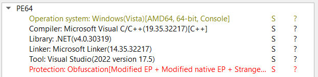

- Có thể thấy trong DIE thì file này đã bị obfuscate. Để deobfuscate, mình đã sử dụng tool de4dot.

    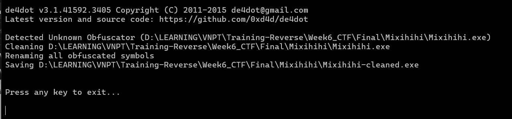

- Sau khi đã deobfuscate xong sẽ sinh ra một file `Mixihihi-cleaned.exe`.
- Vì file này được mix giữa C# và C++ nên mình load nó vào tool dnSpy.
## [2] PHÂN TÍCH
- Trong dnSpy, tìm hàm `main()` thì thấy có đoạn nhập input và kiểm tra ciphertext sau khi đã mã hoá.

    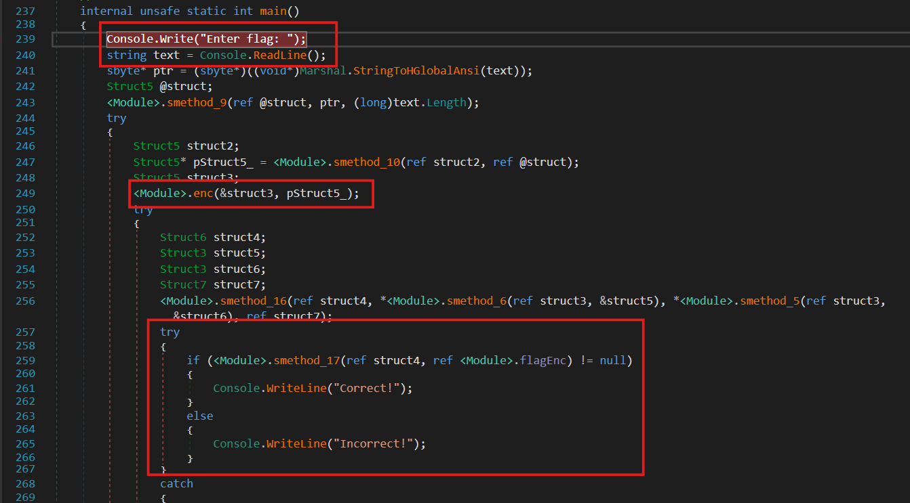

- Focus vào hàm `enc()` thì thấy có từ khoá `extern`, điều này có nghĩa là hàm `enc()` không được khởi tạo trong đoạn code C# hiện tại, mà nó được khởi tạo trong C++

    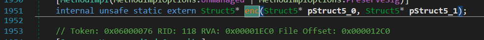

- Khi load file PE này vào IDA, để có thể theo dõi được flow chương trình, mình mở bảng Strings và thấy có đoạn khá đáng ngờ.

    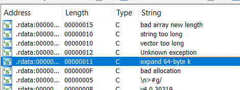

- Tìm chỗ sử dụng đoạn string này thì thấy có những đoạn như sau:

    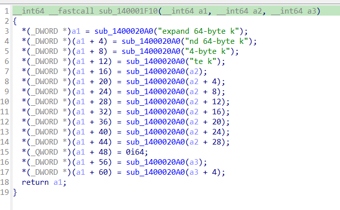

- Tại đây chương trình đang gọi khá nhiều lần hàm `sub_1400020A0()`, hàm này lấy 4 byte đầu của tham số ở thứ tự little endian rồi gán lần lượt vào từng khối 4 byte của tham số `a1`

    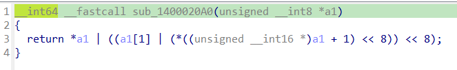

- Tiếp theo xref hàm `sub_140001F10()` xem nó gọi ở chỗ nào.

    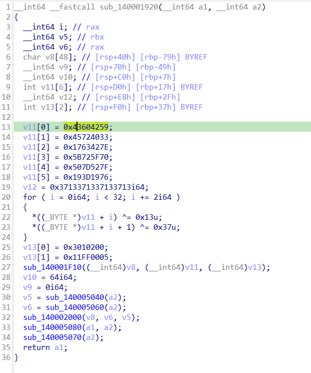

- Như vậy là các byte được truyền vào hàm `sub_140001F10()` đã khá clear. Sau đó mình xem ở dòng 32 có call tới hàm `sub_140002000()`. Ở hàm này và hàm được gọi bên trong nó cho mình thấy dấu hiệu rất rõ của loại mã hoá ChaCha20/Salsa20.

    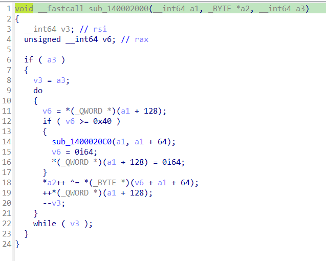

    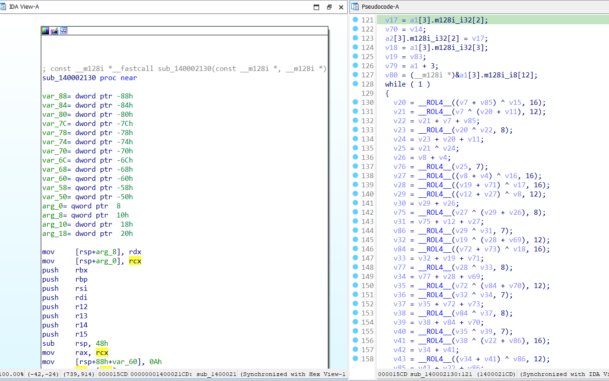

- Quay trở lại hàm `sub_140001920()`. Dự đoán đây chính là hàm `enc()` extern trong phần code C#.
- Giờ hãy quay trở lại dnSpy, xem biến `flagEnc` được mã hoá ở đâu, thì mình thấy có hàm `smethod_0()` sử dụng biến này như 1 biến global và được gán các giá trị như sau:

    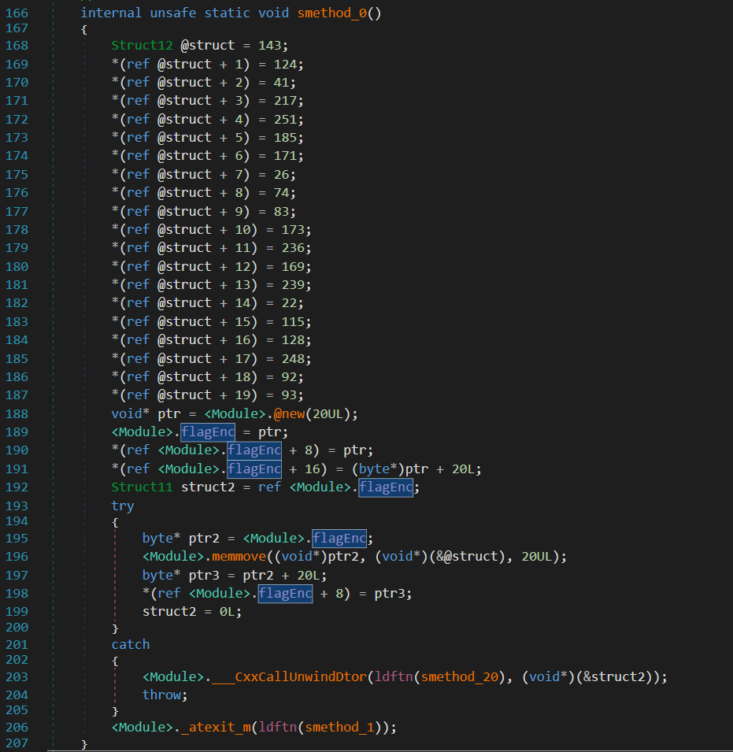

## [3] SOLVE
- Như vậy mình đã xác định được `flagEnc` và loại mã hoá của chương trình là ChaCha20/Salsa20, đây là mã hóa đối xứng dòng. Vì thế, để có thể lấy được flag ban đầu, mình chỉ cần nhập `flagEnc` vào chỗ yêu cầu input và follow địa chỉ của nó đến chỗ compare là có thể thấy được flag của challenge này.

    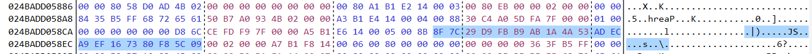

    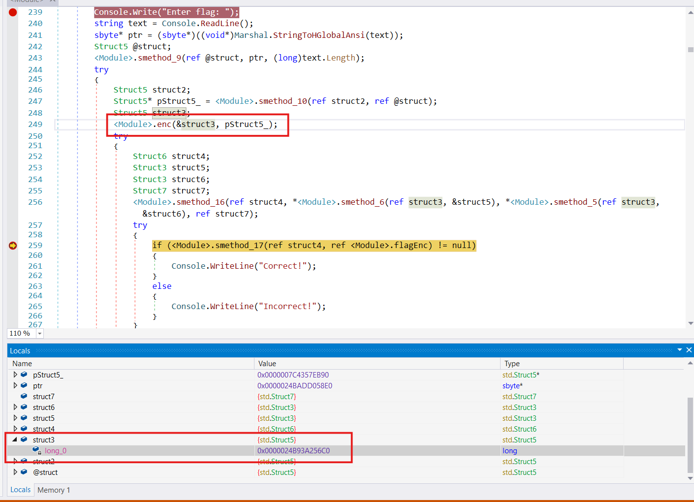

    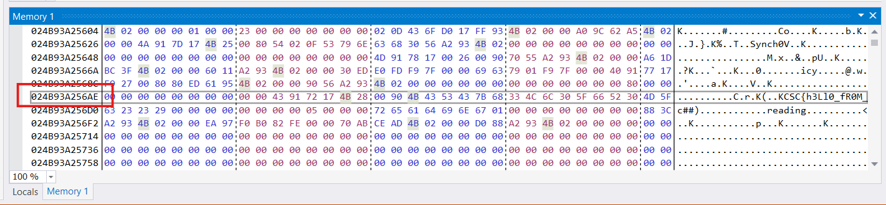

> **Flag:** `KCSC{h3Ll0_fR0M_c##)`