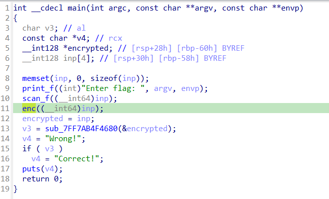
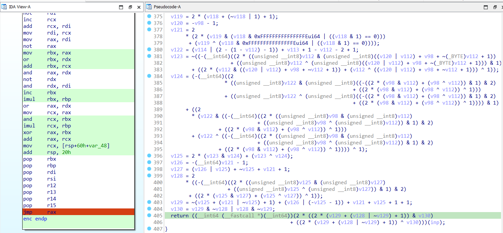
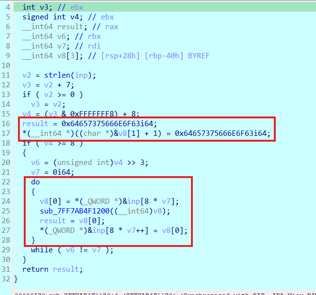
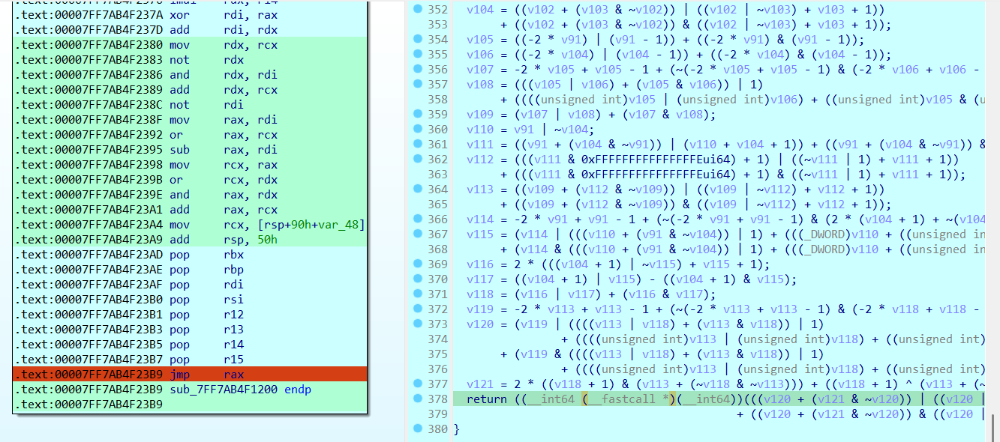
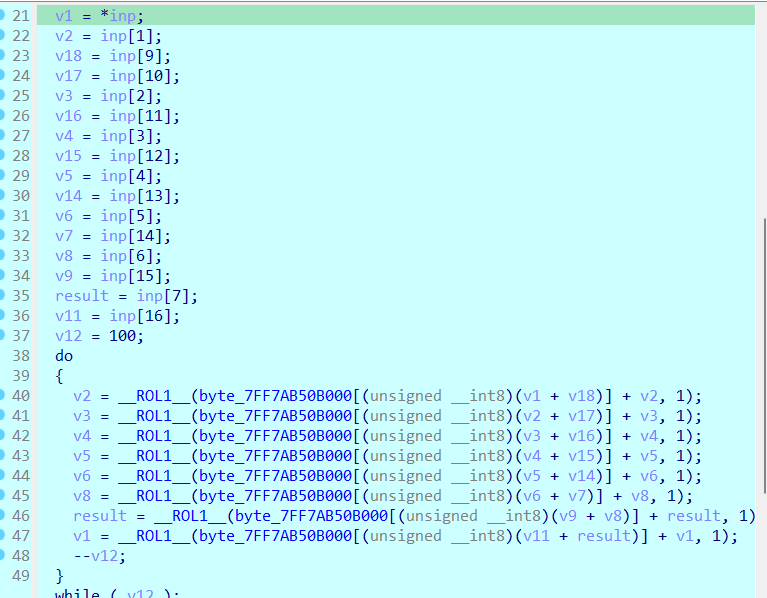
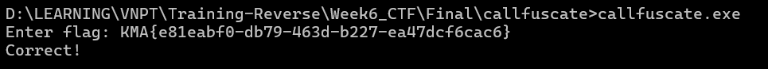

# callfuscate

## [1] TỔNG QUAN
- Đây là chương trình mã hoá và kiểm tra input đơn giản.
- Kỹ thuật được sử dụng: obfuscate cơ bản, không gây ảnh hưởng đến input hay data hoặc key mã hoá.

## [2] PHÂN TÍCH
- Ở hàm `main()` sau khi nhập input vào thì có 1 hàm mã hoá `enc()`

    

- Hàm này có khá nhiều biểu thức tính toán, tuy nhiên, nó không ảnh hưởng gì đến input người dùng nhập vào hay data có sẵn, nó chỉ sử dụng để tính toán địa chỉ gọi hàm ở chỗ return.

    

- Đoạn này lấy từng khối 8 byte của input rồi chèn thêm 8 byte `b'confused'` vào cuối rồi tiến vào hàm mã hoá `sub_7FF7AB4F1200()`.

    

- Hàm `sub_7FF7AB4F1200()` tiếp tục xử lý các phép toán rồi gọi hàm thông qua địa chỉ ở chỗ return và không ảnh hưởng gì tới input.

    

- Địa chỉ hàm được gọi tới từ chỗ return trên chính là hàm encrypt chính của cả chương trình.

    

- Hàm này lần lượt lấy từng byte của phần ghép giữa khối 8 byte input + chuỗi byte `b'confused'` rồi thực hiện dịch trái 100 bit rồi gán lại vào chuỗi input
- Như vậy có thể thấy rất rõ ràng cách mã hoá của chương trình, chúng ta chỉ cần dịch ngược lại 2 hàm này là xong.

## [3] SOLVE
- Code:
    ```python
    KEY_BYTES = b'confused'
    def ROR(byte, count):
        return ((byte >> count) | (byte << (8 - count))) & 0xFF

    def decrypt_block(block, sbox):
        inp = bytearray(17)
        inp[0:8] = block
        inp[9:17] = KEY_BYTES
        v1 = inp[0]
        v2 = inp[1]
        v3 = inp[2]
        v4 = inp[3]
        v5 = inp[4]
        v6 = inp[5]
        v8 = inp[6]
        result = inp[7]
        v18 = inp[9]
        v17 = inp[10]
        v16 = inp[11]
        v15 = inp[12]
        v14 = inp[13]
        v7 = inp[14]
        v9 = inp[15]
        v11 = inp[16]

        for _ in range(100):
            temp_v1 = v1
            temp_v2 = v2
            temp_v3 = v3
            temp_v4 = v4
            temp_v5 = v5
            temp_v6 = v6
            temp_v8 = v8
            temp_result = result
            v1 = (ROR(temp_v1, 1) - sbox[(v11 + temp_result) & 0xFF]) & 0xFF
            result = (ROR(temp_result, 1) - sbox[(v9 + temp_v8) & 0xFF]) & 0xFF
            v8 = (ROR(temp_v8, 1) - sbox[(v6 + v7) & 0xFF]) & 0xFF
            v6 = (ROR(temp_v6, 1) - sbox[(temp_v5 + v14) & 0xFF]) & 0xFF
            v5 = (ROR(temp_v5, 1) - sbox[(temp_v4 + v15) & 0xFF]) & 0xFF
            v4 = (ROR(temp_v4, 1) - sbox[(temp_v3 + v16) & 0xFF]) & 0xFF
            v3 = (ROR(temp_v3, 1) - sbox[(temp_v2 + v17) & 0xFF]) & 0xFF
            v2 = (ROR(temp_v2, 1) - sbox[(v1 + v18) & 0xFF]) & 0xFF
        return bytes([v1, v2, v3, v4, v5, v6, v8, result])

    def decrypt(ciphertext, sbox):
        plaintext = bytearray()
        
        for i in range(0, len(ciphertext), 8):
            block = ciphertext[i:i+8]
            decrypted_block = decrypt_block(block, sbox)
            plaintext.extend(decrypted_block)
            
        return bytes(plaintext)

    sbox = [0x63, 0x7C, 0x77, 0x7B, 0xF2, 0x6B, 0x6F, 0xC5, 0x30, 0x01, 
    0x67, 0x2B, 0xFE, 0xD7, 0xAB, 0x76, 0xCA, 0x82, 0xC9, 0x7D, 
    0xFA, 0x59, 0x47, 0xF0, 0xAD, 0xD4, 0xA2, 0xAF, 0x9C, 0xA4, 
    0x72, 0xC0, 0xB7, 0xFD, 0x93, 0x26, 0x36, 0x3F, 0xF7, 0xCC, 
    0x34, 0xA5, 0xE5, 0xF1, 0x71, 0xD8, 0x31, 0x15, 0x04, 0xC7, 
    0x23, 0xC3, 0x18, 0x96, 0x05, 0x9A, 0x07, 0x12, 0x80, 0xE2, 
    0xEB, 0x27, 0xB2, 0x75, 0x09, 0x83, 0x2C, 0x1A, 0x1B, 0x6E, 
    0x5A, 0xA0, 0x52, 0x3B, 0xD6, 0xB3, 0x29, 0xE3, 0x2F, 0x84, 
    0x53, 0xD1, 0x00, 0xED, 0x20, 0xFC, 0xB1, 0x5B, 0x6A, 0xCB, 
    0xBE, 0x39, 0x4A, 0x4C, 0x58, 0xCF, 0xD0, 0xEF, 0xAA, 0xFB, 
    0x43, 0x4D, 0x33, 0x85, 0x45, 0xF9, 0x02, 0x7F, 0x50, 0x3C, 
    0x9F, 0xA8, 0x51, 0xA3, 0x40, 0x8F, 0x92, 0x9D, 0x38, 0xF5, 
    0xBC, 0xB6, 0xDA, 0x21, 0x10, 0xFF, 0xF3, 0xD2, 0xCD, 0x0C, 
    0x13, 0xEC, 0x5F, 0x97, 0x44, 0x17, 0xC4, 0xA7, 0x7E, 0x3D, 
    0x64, 0x5D, 0x19, 0x73, 0x60, 0x81, 0x4F, 0xDC, 0x22, 0x2A, 
    0x90, 0x88, 0x46, 0xEE, 0xB8, 0x14, 0xDE, 0x5E, 0x0B, 0xDB, 
    0xE0, 0x32, 0x3A, 0x0A, 0x49, 0x06, 0x24, 0x5C, 0xC2, 0xD3, 
    0xAC, 0x62, 0x91, 0x95, 0xE4, 0x79, 0xE7, 0xC8, 0x37, 0x6D, 
    0x8D, 0xD5, 0x4E, 0xA9, 0x6C, 0x56, 0xF4, 0xEA, 0x65, 0x7A, 
    0xAE, 0x08, 0xBA, 0x78, 0x25, 0x2E, 0x1C, 0xA6, 0xB4, 0xC6, 
    0xE8, 0xDD, 0x74, 0x1F, 0x4B, 0xBD, 0x8B, 0x8A, 0x70, 0x3E, 
    0xB5, 0x66, 0x48, 0x03, 0xF6, 0x0E, 0x61, 0x35, 0x57, 0xB9, 
    0x86, 0xC1, 0x1D, 0x9E, 0xE1, 0xF8, 0x98, 0x11, 0x69, 0xD9, 
    0x8E, 0x94, 0x9B, 0x1E, 0x87, 0xE9, 0xCE, 0x55, 0x28, 0xDF, 
    0x8C, 0xA1, 0x89, 0x0D, 0xBF, 0xE6, 0x42, 0x68, 0x41, 0x99, 
    0x2D, 0x0F, 0xB0, 0x54, 0xBB, 0x16]

    ciphertext = bytes([0xE5, 0xA8, 0x07, 0x2E, 0xE8, 0x67, 0xB5, 0x0C, 0xF9, 0x05, 
    0xA1, 0xA8, 0xFA, 0x05, 0x0A, 0x66, 0xA0, 0xC1, 0x20, 0x4E, 
    0xE3, 0x7D, 0xD0, 0x04, 0x21, 0x67, 0xEC, 0x9E, 0x7D, 0xBC, 
    0x2D, 0x8D, 0x9B, 0x65, 0xDC, 0x71, 0xE4, 0x57, 0x81, 0x11, 
    0x1A, 0x71, 0x7F, 0x84, 0x2C, 0x88, 0x25, 0x94])

    plaintext_result = decrypt(ciphertext, sbox)
    print(f"Plaintext (hex): {plaintext_result.hex()}")
    try:
        print(f"Plaintext (text): {plaintext_result.decode('utf-8', errors='replace')}")
    except UnicodeDecodeError as e:
        print(f"Không thể giải mã plaintext thành chuỗi UTF-8: {e}")
    # flag: KMA{e81eabf0-db79-463d-b227-ea47dcf6cac6}
    ```

    

> **Flag:** `KMA{e81eabf0-db79-463d-b227-ea47dcf6cac6}`