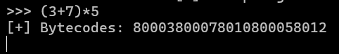

# interpreter_1

## **[1] TỔNG QUAN**
- Chương trình này được viết bằng C++, yêu cầu nhập input và kiểm tra đúng sai như bình thường.
- Input cần nhập chính là một biểu thức toán học, dạng biểu thức trung tố, input này được mã hoá rồi sinh ra output là một biểu thức hậu tố.
- Tuy nhiên, chương trình này chủ yếu sử dụng kỹ thuật obfuscate, nên sẽ khá khó để follow theo đúng luồng chương trình.

## **[2] PHÂN TÍCH**
- Đoạn đầu tiên trong hàm `main()` yêu cầu nhập input:
    
    

- `v33` và `v34` lần lượt lưu các byte của ciphertext:

    

- Tại dòng 47, hàm `sub_6367A8654760()` được gọi để kiểm tra từng ký tự của input xem có hợp lệ hay không:

    

- Đoạn đầu tiên của hàm này thực hiện kiểm tra string truyền vào không rỗng:

    

- Tại dòng 35 của hàm này có câu lệnh rẽ nhánh switch-case gọi hàm `categorizeChar()` kiểm tra ký tự hiện tại là ký tự chữ số, các dấu phép toán hay các dấu ngoặc rồi return ra các giá trị dựa trên kết quả kiểm tra, nếu ký tự đó không phải là các biểu thức tính toán thì sẽ return giá trị sai và chương trình sẽ kết thúc.

    

    

- Dựa vào các ký tự được kiểm tra trên, có thể dự đoán input nhập vào buộc phải là 1 biểu thức hợp lệ của các số và các toán tử, hoặc dấu ngoặc.
- Chạy thử chương trình rồi truyền vào một biểu thức tính toán bất kỳ rồi xem cách mã hoá của chương trình:

    

- Từ output có thể đoán được quy luật mã hoá của chương trình:
    - Số nhập vào là số hệ 10 sẽ được chuyển thành số hệ hexa và tiền tố được thêm vào là `8000`.
    - Các toán tử `+`, `-`, `*`, `/`, `%` lần lượt là `8010`, `8011`, `8012`, `8013`, `8014`
    - Biểu thức đã mã hoá được biểu diễn dưới dạng hậu tố.
- Đoạn dưới có chỗ check input đã mã hoá với ciphertext mà đề bài cho sẵn:

    

- Tuy nhiên, khi ghép các phần của ciphertext lại thì thấy có vẻ thừa một số chữ số. Lúc này chúng ta có thể debug để xem thực sự chương trình đang mã hoá như thế nào:

    

- Tại hàm `check_inp()`, kiểm tra tham số truyền vào, có `v23`, đoán đây chính là input nhập vào đã bị mã hoá

    

    

- Có thể thấy với input là `(3+7)*5` thì chuỗi encryption luôn có các số 0 chen vào giữa các số được nhập, còn các toán tử thì không. Dự đoán cách mã hoá như sau:
    - Trước các byte `0` ngăn cách, tìm kiếm byte `0x80`, tính từ byte này, dịch 2 byte sau sẽ luôn là `0x00`, ghép lại thành `8000` là tiền tố của 1 số.
    - Byte ở giữa là toán hạng trong biểu thức nhập vào, khi ghép với tiền tố, chỉ lấy các số có ý nghĩa (tức là `0x03` -> `3`).
    - Các toán tử sẽ lấy 2 byte liền nhau nhưng đảo ngược thứ tự.
- Từ đó, chúng ta có thể phân tích mảng byte của cipher để tìm lại được chuỗi plaintext gốc.
- Ciphertext được cho như dưới, tách các phần tử ra để dễ phân tích:
    ```
    80003 80002 80005 8012 80004 8011 8010 80007 80006 80003 8013 8012 8010
      3     2     5    *     4    -    +     7     6     3    /    *    +
    ```

## **[3] SOLVE**
- Sau khi đã phân tích được ciphertext thành dạng biểu thức hậu tố, chúng ta chỉ cần viết 1 script python để đổi lại thành biểu thức dạng trung tố:

    ```python
    def postfix_to_infix(postfix):
        stack = []
        operators = set("+-*/")

        for char in postfix:
            if char not in operators:
                stack.append(char)
            else:
                b = stack.pop()
                a = stack.pop()
                expr = f"({a}{char}{b})"
                stack.append(expr)
        return stack[0]

    postfix_expr = "325*4-+763/*+"
    infix_expr = postfix_to_infix(postfix_expr)
    print("Postfix:", postfix_expr)
    print("Infix:", infix_expr)

    # Input: ((3+((2*5)-4))+(7*(6/3)))
    ```
- Như vậy, input cần nhập vào chương trình này là `((3+((2*5)-4))+(7*(6/3)))`

    